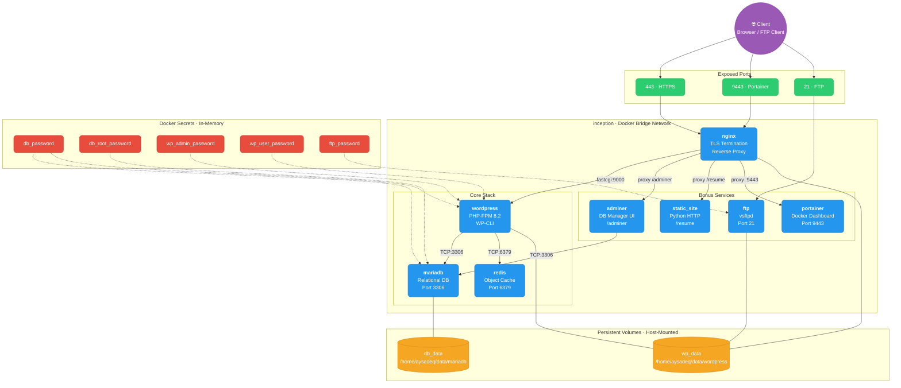

<div align="center">

# 🐳 Inception

**A fully automated, multi-container Docker infrastructure built from scratch.**

A production-style microservice stack comprising **8 Docker containers** — each built from a custom Dockerfile on `debian:bookworm` — orchestrated via Docker Compose, secured with TLS encryption and Docker Secrets, and backed by persistent host-mounted volumes.

</div>

---

## 🏗️ Architecture



**Request flow:** A client connects to **NGINX** on port `443` over TLS. NGINX terminates SSL and forwards PHP requests to **WordPress** via FastCGI on port `9000`. WordPress queries **MariaDB** on port `3306` and caches objects in **Redis** on port `6379`. Bonus services (Adminer, Static Site) are reverse-proxied behind NGINX at their respective URL paths. Portainer is served on a dedicated port `9443`. FTP provides direct file access to the WordPress volume on port `21`.

---

## 🐳 Services

| Service | Role | Port | Highlights |
|:--------|:-----|:-----|:-----------|
| **nginx** | TLS termination & reverse proxy | `443`, `9443` | Self-signed cert · TLSv1.2/1.3 only · Reverse proxy for Adminer, Static Site, Portainer |
| **wordpress** | CMS via PHP-FPM 8.2 | `9000` *(internal)* | Fully automated install via WP-CLI · Redis cache integration · Two preconfigured users |
| **mariadb** | Relational database | `3306` *(internal)* | Idempotent init script · Passwords via Docker Secrets · Runs as `mysql` user |
| **redis** | Object cache for WordPress | `6379` *(internal)* | Reduces database load · `redis-cache` WP plugin auto-configured |
| **adminer** | Database management UI | `8080` *(internal)* | Accessible at `/adminer` via NGINX reverse proxy |
| **ftp** | FTP access to WordPress files | `21`, `21100-21110` | vsftpd · Passive mode · Chrooted to WordPress volume |
| **portainer** | Docker management dashboard | `9443` *(via NGINX)* | Full container monitoring & control UI |
| **static_site** | Static showcase page | `8080` *(internal)* | Python HTTP server · Accessible at `/resume` |

> All containers are built from `debian:bookworm` using custom Dockerfiles. Every daemon runs in the **foreground as PID 1** — no `tail -f`, `sleep infinity`, or background hacks.

---

### Service Deep Dives

<details>
<summary><b>NGINX</b> — TLS Termination & Reverse Proxy</summary>

<br/>

**Dockerfile** installs `nginx` and `openssl`, copies a custom `nginx.conf`, and sets the entrypoint to [`setup-ssl.sh`](srcs/requirements/nginx/tools/setup-ssl.sh).

**Entrypoint script** (`setup-ssl.sh`):
1. Checks if a self-signed SSL certificate already exists at `/etc/ssl/certs/nginx.crt`
2. If not, generates a new RSA-2048 certificate using `openssl req -x509` with the domain from `$DOMAIN_NAME`
3. Launches NGINX in the foreground via `exec nginx -g "daemon off;"`

**Configuration** ([`nginx.conf`](srcs/requirements/nginx/conf/nginx.conf)):
- **Primary server block** (port `443`) — serves WordPress via FastCGI, reverse-proxies `/adminer` and `/resume` to their respective containers
- **Secondary server block** (port `9443`) — reverse-proxies to Portainer's HTTPS endpoint
- Enforces `ssl_protocols TLSv1.2 TLSv1.3` on both blocks

</details>

<details>
<summary><b>WordPress</b> — CMS Engine (PHP-FPM + WP-CLI)</summary>

<br/>

**Dockerfile** installs PHP-FPM 8.2 with extensions (`php-mysql`, `php-curl`, `php-gd`, `php-xml`, `php-mbstring`), downloads `mariadb-client` for health checks, and fetches [WP-CLI](https://wp-cli.org/) to automate the entire WordPress setup.

**Entrypoint script** ([`setup-wp.sh`](srcs/requirements/wordpress/tools/setup-wp.sh)):
1. Reads passwords from Docker Secrets (`/run/secrets/db_password`, `wp_admin_password`, `wp_user_password`)
2. Blocks until MariaDB is reachable — polls with `mariadb -h mariadb` over the Docker network
3. On first run (no `wp-config.php` found):
   - Downloads WordPress core via `wp core download`
   - Generates `wp-config.php` with database credentials
   - Runs `wp core install` with admin user and site URL
   - Creates a second user with `author` role
   - Configures Redis cache: sets `WP_REDIS_HOST`, installs `redis-cache` plugin, enables it
   - Sets file ownership to `www-data`
4. Launches PHP-FPM in the foreground via `exec php-fpm8.2 -F`

**PHP-FPM config** ([`www.conf`](srcs/requirements/wordpress/conf/www.conf)):
- Listens on TCP port `9000` (not a Unix socket) for communication with NGINX
- Uses `clear_env = no` to preserve Docker environment variables
- Dynamic process management: 2 start servers, up to 5 max children

</details>

<details>
<summary><b>MariaDB</b> — Database Server</summary>

<br/>

**Dockerfile** installs `mariadb-server`, copies a custom `50-server.cnf`, and sets the entrypoint to [`init-db.sh`](srcs/requirements/mariadb/tools/init-db.sh).

**Entrypoint script** ([`init-db.sh`](srcs/requirements/mariadb/tools/init-db.sh)):
1. Creates `/run/mysqld` and ensures correct ownership for the socket file
2. Reads passwords from Docker Secrets (`db_password`, `db_root_password`)
3. On first run (database directory doesn't exist):
   - Starts MariaDB temporarily in the background
   - Waits for readiness via `mysqladmin ping`
   - Executes SQL: creates the database, creates the application user with full grants, secures the root password
   - Gracefully shuts down the temporary instance with `mysqladmin shutdown`
4. Launches the final MariaDB process in the foreground via `exec mysqld --user=mysql`

**Server config** ([`50-server.cnf`](srcs/requirements/mariadb/conf/50-server.cnf)):
- `bind-address = 0.0.0.0` — allows connections from other containers over the Docker bridge network
- Runs as `mysql` user on port `3306`
- Data directory at `/var/lib/mysql` (backed by `db_data` volume)

</details>

<details>
<summary><b>Redis</b> — WordPress Object Cache</summary>

<br/>

**Dockerfile** installs `redis-server` and launches it directly with `--protected-mode no` to accept connections from the WordPress container over the Docker network.

Redis is automatically configured by the WordPress entrypoint script, which installs the `redis-cache` plugin and points it to `redis:6379`.

</details>

<details>
<summary><b>Adminer</b> — Database Management UI</summary>

<br/>

**Dockerfile** installs PHP 8.2 CLI and the MySQL extension, then downloads the latest Adminer PHP file from the [official source](https://www.adminer.org/). Runs PHP's built-in web server on port `8080`, served at `/adminer` via the NGINX reverse proxy.

</details>

<details>
<summary><b>FTP</b> — File Transfer to WordPress Volume</summary>

<br/>

**Dockerfile** installs `vsftpd` and copies a custom config and init script.

**Entrypoint script** ([`init-ftp.sh`](srcs/requirements/Bonuses/ftp/tools/init-ftp.sh)):
1. Reads the FTP password from Docker Secrets
2. Creates the FTP user with home directory set to `/var/www/wordpress`
3. Adds the user to the `www-data` group for proper file permissions
4. Launches vsftpd in the foreground

**Config**: Local users enabled, chrooted to `/var/www/wordpress`, passive mode on ports `21100–21110`.

</details>

<details>
<summary><b>Portainer</b> — Docker Management Dashboard</summary>

<br/>

**Dockerfile** downloads the Portainer CE binary (v2.16.2) directly from GitHub releases — no pre-built Docker image. Mounts `/var/run/docker.sock` from the host to manage containers. Accessible via NGINX reverse proxy on port `9443`.

</details>

<details>
<summary><b>Static Site</b> — Showcase Page</summary>

<br/>

**Dockerfile** installs Python 3 and serves a static HTML page using Python's built-in HTTP server on port `8080`. Accessible at `/resume` via the NGINX reverse proxy. Uses Python instead of PHP (as required by the subject).

</details>

---

## 📁 Project Structure

```
Inception/
├── Makefile                            # Build, start, stop, clean
├── README.md
├── secrets/                            # 🔒 .gitignored — Docker Secrets
│   ├── db_password.txt
│   ├── db_root_password.txt
│   ├── wp_admin_password.txt
│   ├── wp_user_password.txt
│   └── ftp_password.txt
└── srcs/
    ├── .env                            # Non-sensitive config (domain, usernames)
    ├── docker-compose.yml              # All 8 services, volumes, network, secrets
    └── requirements/
        ├── mariadb/
        │   ├── Dockerfile
        │   ├── conf/50-server.cnf      # bind-address, port, datadir
        │   └── tools/init-db.sh        # Idempotent DB initialization
        ├── nginx/
        │   ├── Dockerfile
        │   ├── conf/nginx.conf         # TLS, FastCGI, reverse proxies
        │   └── tools/setup-ssl.sh      # Self-signed certificate generation
        ├── wordpress/
        │   ├── Dockerfile
        │   ├── conf/www.conf           # PHP-FPM pool configuration
        │   └── tools/setup-wp.sh       # WP-CLI automated installation
        └── Bonuses/
            ├── adminer/
            │   └── Dockerfile
            ├── ftp/
            │   ├── Dockerfile
            │   ├── conf/vsftpd.conf    # Passive mode, chroot config
            │   └── tools/init-ftp.sh   # User creation, permissions
            ├── portainer/
            │   └── Dockerfile
            ├── redis/
            │   └── Dockerfile
            └── static_site/
                ├── Dockerfile
                └── index.html
```

---

## ⚡ Quick Start

### Prerequisites

- **Docker Engine** and **docker compose** (v2) installed
- **make** utility available
- **Root/sudo** access (for volume directory creation and cleanup)

### 1. Clone & enter the repository

```bash
git clone https://github.com/aysadeq/Inception.git
cd Inception
```

### 2. Configure environment variables

Create the `srcs/.env` file with your configuration:

```bash
cat > srcs/.env << 'EOF'
# Domain
DOMAIN_NAME=aysadeq.42.fr

# MariaDB
MYSQL_DATABASE=wordpress_db
MYSQL_USER=wp_user

# WordPress admin
WP_ADMIN_USER=superchief
WP_ADMIN_EMAIL=superchief@42.fr

# WordPress regular user
WP_USER=editor42
WP_USER_EMAIL=editor@42.fr

# FTP
FTP_USER=ftpuser
EOF
```

### 3. Create Docker Secrets

Create a `secrets/` directory and populate it with raw passwords (**no trailing newlines**):

```bash
mkdir -p secrets
echo -n "your_db_password"       > secrets/db_password.txt
echo -n "your_db_root_password"  > secrets/db_root_password.txt
echo -n "your_wp_admin_password" > secrets/wp_admin_password.txt
echo -n "your_wp_user_password"  > secrets/wp_user_password.txt
echo -n "your_ftp_password"      > secrets/ftp_password.txt
```

### 4. Configure DNS

Map the domain to your local machine:

```bash
echo "127.0.0.1 aysadeq.42.fr" | sudo tee -a /etc/hosts
```

### 5. Build & launch

```bash
make
```

This builds all 8 images from source, creates the Docker network and volumes, and starts every container in detached mode.

### 6. Access the services

| Service | URL |
|:--------|:----|
| WordPress site | `https://aysadeq.42.fr` |
| WordPress admin | `https://aysadeq.42.fr/wp-admin` |
| Adminer | `https://aysadeq.42.fr/adminer` |
| Static site | `https://aysadeq.42.fr/resume` |
| Portainer | `https://aysadeq.42.fr:9443` |
| FTP | `ftp://aysadeq.42.fr` (port 21) |

> ⚠️ Accept the self-signed TLS certificate warning in your browser on first visit.

---

## 🛠️ Makefile Reference

| Command | Action |
|:--------|:-------|
| `make` | Build all images and start the infrastructure |
| `make down` | Stop containers — data is preserved |
| `make clean` | Stop containers and remove Docker volumes |
| `make fclean` | **Full teardown** — removes containers, images, and all host data |
| `make re` | Clean rebuild from scratch (`fclean` + `make`) |

---

<div align="center">

*Built by [aysadeq](https://github.com/aysadeq) as part of the 42 curriculum.*

</div>