# Inception Learning Guide

This guide is designed to take you from foundational operating system concepts all the way to understanding the complex interactions of a multi-container web architecture. It is broken down into four modules, ensuring every major concept is explained in detail.

> **The One-Sentence Summary:** A container is just a normal Linux process that the kernel is **lying to** (Namespaces), **restricting** (Cgroups), and running on a **layered, shared filesystem** (OverlayFS).

---

## Module Overview

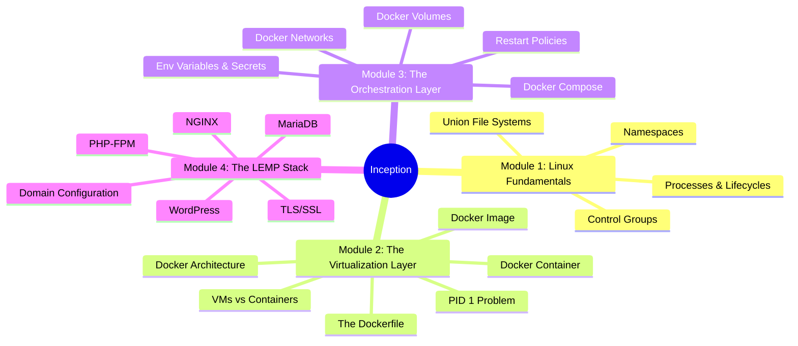

---

## Module 1: Linux & Operating System Fundamentals

*Understanding the Linux operating system is the key to truly grasping how containers work under the hood. Containers are not magic; they are just isolated Linux processes.*

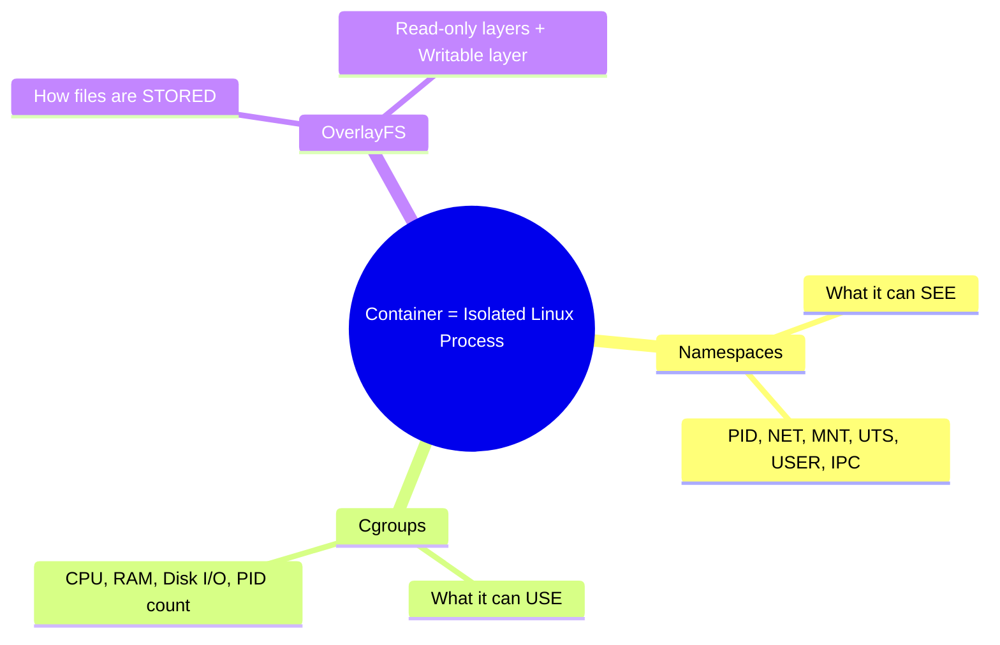

### 1. Processes and Lifecycles

#### What is a Process?
Imagine you have an executable file on your hard drive, like `/bin/bash` or `/usr/sbin/nginx`. Right now, that file is just dormant code sitting on a disk. It is doing nothing.
*   **A program** is code at rest.
*   **A process** is code in motion.

When you execute that program, the Linux kernel loads it into RAM, assigns it CPU time, and gives it a unique ID number called a **PID (Process ID)**. The kernel also keeps track of its environment variables, the files it has open, and its current state.

**In the context of containers:** When you run a Docker container, you are literally just telling the host's Linux kernel to start a process, but you are wrapping that process in Namespaces and Cgroups to isolate it.

#### The Process Tree and PID 1
Processes in Linux reproduce like a family tree. A process cannot magically appear; it must be spawned by an existing process.

When a process wants to create a child, it performs a system call called `fork()`, which creates an exact clone of itself, followed by `exec()`, which replaces the clone's memory with a new program.
*   If process A (PID 100) spawns process B, Process A is the **Parent**, and Process B (PID 101) is the **Child**.

When a standard Linux computer boots up, the kernel starts the very first process. This process is assigned **PID 1**. On modern Linux systems, PID 1 is usually a program called `systemd` or `init`. PID 1 is the great-grandfather of every single process on your computer.

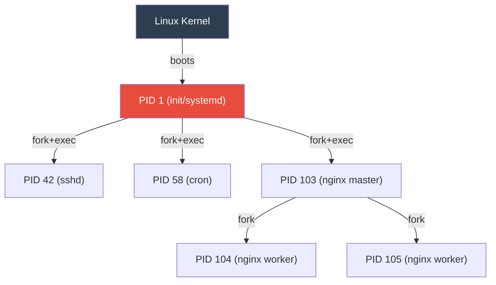

**The Container Context (The PID 1 Problem):**
Because a container has an isolated PID Namespace, it gets its own brand new process tree. When you write a Dockerfile and use the `CMD` or `ENTRYPOINT` instruction (e.g., `CMD ["nginx", "-g", "daemon off;"]`), **that specific command becomes PID 1 inside the container.** But PID 1 has special responsibilities (see Zombies and Orphans below).

#### Process States and Signals
Processes don't run continuously. The kernel rapidly switches them between states (Running, Sleeping, Stopped).

When you (or the OS) want to communicate with a process, you send it a **Signal**:
*   **`SIGTERM` (Signal 15):** A polite request. "Please wrap up what you are doing, save your data, and shut down." The process can catch this signal and run cleanup code.
*   **`SIGKILL` (Signal 9):** A shotgun. Goes straight to the kernel. The process is instantly annihilated. It cannot be caught or ignored.

**The Container Context:**
When you type `docker stop <container>`, Docker sends `SIGTERM` to **PID 1** inside the container. It waits 10 seconds. If the container hasn't stopped, it murders it with `SIGKILL`.

**The catch:** The Linux kernel gives special protection to PID 1. By default, PID 1 ignores `SIGTERM` unless the program was specifically coded to handle it. If your Dockerfile runs a simple bash script that doesn't handle signals, `docker stop` will hang for 10 seconds every time, then force a `SIGKILL`, which can corrupt databases!

#### Zombies and Orphans
When a child process finishes running, it dies. However, it leaves behind a tiny data structure (an exit status) so its parent can check if it succeeded or failed.
*   **Zombie:** A process that is dead, but its parent hasn't collected its exit status yet. It sits around consuming an entry in the process table.
*   **Orphan:** If a parent process crashes and dies before its child process finishes, the child becomes an Orphan.

**The Reaper (PID 1's most important job):**
An Orphan process is immediately adopted by **PID 1**. PID 1's sacred duty is to periodically "reap" (collect the exit statuses of) dead children and clear them out of the process table.

**The Container Context:**
Your application (like a bash script or `tail -f`) is PID 1 in a container. If your application spawns child processes (which NGINX, PHP-FPM, and bash scripts do constantly), and those children die, your application is now responsible for reaping them.
*   Does `tail -f /dev/null` know how to reap zombie processes? **No.**
*   Does `sleep infinity` know how to reap zombies? **No.**

This is exactly why the 42 subject forbids `tail -f` and infinite loops!

---

### 2. Namespaces

#### What is a Namespace?
Normally, any process running on a Linux machine has a global view of the system. It can see every hard drive mounted, every network interface, and every other process running.

A **Namespace** is a feature of the Linux kernel that takes a specific resource (like the network or the process list) and partitions it. When a process is placed inside a namespace, its vision is restricted. It can *only* see the resources associated with that specific namespace. It has no idea the rest of the computer exists.

Docker didn't invent this! Namespaces have been a part of the Linux kernel since 2002. Docker just made them easy to use.

#### The 6 Core Namespaces

When Docker creates a container, it wraps the process in all six namespaces simultaneously:

| Namespace | The Lie Docker Tells the Process | Reality |
|-----------|----------------------------------|---------|
| **PID** | "You are PID 1, the only process running." | It's actually PID 8432 on the host. The kernel maps the real PID to a fake one. |
| **NET** | "You have your own network card and IP address." | The host has one physical NIC. Docker creates virtual interfaces inside the namespace. |
| **MNT** | "You have your own hard drive starting at `/`." | The process can't see the host's files. A specific folder on the host is presented as the root filesystem. |
| **UTS** | "Your hostname is `wordpress`." | The host's real hostname is `aysadeq-laptop`. The container gets its own identity. |
| **IPC** | "You can only talk to processes in your own bubble." | Prevents the container from peeking into the shared memory of host processes. |
| **USER** | "You are the all-powerful root user." | The kernel maps container root to an unprivileged user on the host. |

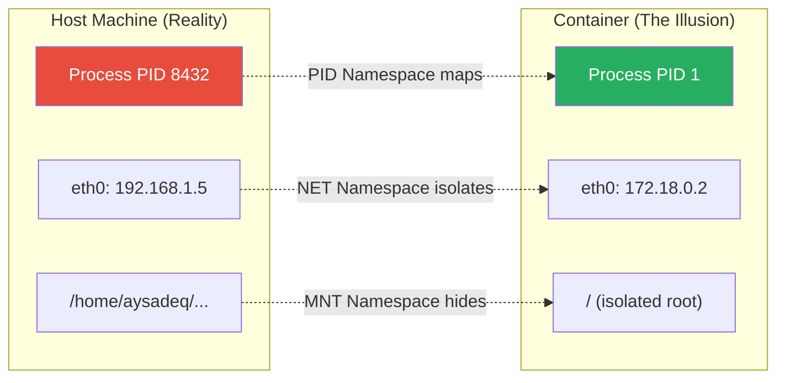

#### Tying it to the Inception Project
*   When you declare a `networks:` block in your compose file, Docker creates a custom **NET Namespace** bridge and plugs all your containers into it.
*   When you declare your `mariadb` and `wordpress` services, they get unique hostnames via the **UTS Namespace**, allowing WordPress to connect to the database simply by querying the name `mariadb`.
*   Because of the **MNT Namespace**, your containers cannot see the host's files. That is *why* the subject requires you to explicitly use **Volumes** — you are telling Docker to punch a small, controlled hole through the MNT namespace.

---

### 3. Control Groups (Cgroups)

If Namespaces are the walls that isolate a container, **Cgroups are the bouncer at the door.**

Namespaces dictate what a container can *see*. Cgroups dictate what a container can *use*.

#### What is a Cgroup?
Control Groups were developed by engineers at Google in 2006 and merged into the Linux kernel shortly after.

Without Cgroups, a buggy container with a memory leak could consume 100% of the host's RAM and crash the entire server, taking down every other container with it. This is called the **"Noisy Neighbor Problem."**

#### What Can Cgroups Limit?

| Resource | How it Limits | What Happens on Violation |
|----------|--------------|---------------------------|
| **Memory (RAM)** | Max allocation (e.g., 512MB) | The kernel's **OOM Killer** sends `SIGKILL` instantly. Container exits with code `137`. |
| **CPU** | Max cores or time percentage | The kernel **throttles** the process (pauses it briefly). It doesn't get killed, just slowed down. |
| **Block I/O** | Max disk read/write speed | Caps disk throughput (e.g., 10MB/s) so other containers can still access the disk. |
| **PID Count** | Max number of processes | Prevents fork bombs. If the container tries to spawn process #51 (with limit 50), the kernel denies it. |

#### How Docker uses Cgroups
Behind the scenes, Docker just navigates to a special folder on your host machine (`/sys/fs/cgroup/`) and writes text files. To limit memory, Docker literally echoes the number "536870912" (512MB in bytes) into a file called `memory.limit_in_bytes` assigned to your container's process tree.

---

### 4. Union File Systems (OverlayFS)

If Namespaces isolate the process, and Cgroups limit its resources, **OverlayFS is what makes the container lightweight and blazingly fast.**

#### The Problem with Virtual Machines
When you create a VM, you allocate a massive chunk of your hard drive (e.g., 20GB) to it. 10 NGINX VMs = **200GB** of space. And 95% of the files in those 10 VMs are identical (the core OS files, the NGINX binaries). A colossal waste.

#### How OverlayFS Works
OverlayFS takes multiple directories on your host machine and stacks them on top of each other, presenting a single, unified view. Imagine stacking sheets of transparent glass, each with some writing on it.

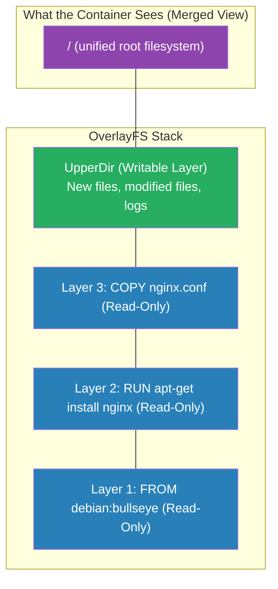

*   **LowerDir (Read-Only):** This is the Docker Image. Completely immutable. If you run 10 containers, they all point to the **exact same** LowerDir on your hard drive. Zero wasted space.
*   **UpperDir (Writable):** A brand new, empty directory created specifically for your running container. The **only** writable part.
*   **Merged View:** What the container actually sees. The kernel overlays the layers and presents them as the root filesystem (`/`).

#### Copy-on-Write (CoW)
What happens if the container needs to modify a file from a read-only layer (like editing `/etc/nginx/nginx.conf`)?

1.  **Read:** The container wants to edit the file.
2.  **Copy:** OverlayFS silently copies that file from the LowerDir up into the writable UpperDir.
3.  **Write:** The container modifies the copy in the UpperDir.
4.  **Hide:** The modified file in the UpperDir now "masks" the original in the LowerDir.

The original image is never touched. If a container *deletes* a file from the LowerDir, OverlayFS creates a special **"whiteout" file** in the UpperDir to hide it.

---

## Module 2: The Virtualization Layer

*Building on Linux fundamentals, this module explores how Docker leverages Namespaces, Cgroups, and UnionFS to create lightweight containers.*

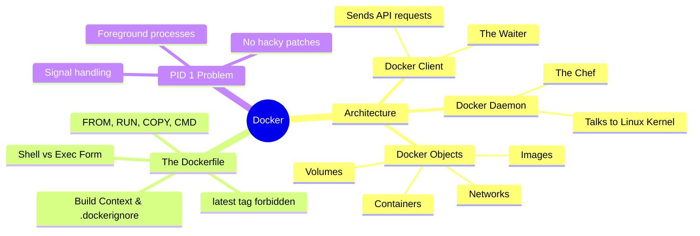

### 1. Virtual Machines vs. Containers

#### The VM Stack (Heavy)
```
┌─────────────────────┐
│   Your Application  │
├─────────────────────┤
│   Bins/Libs/Deps    │
├─────────────────────┤
│  Guest OS (Full     │  ← Entire kernel + OS (GBs of space)
│  Linux Kernel!)     │  ← Takes minutes to boot
├─────────────────────┤
│  Hypervisor         │  ← VirtualBox / VMware
│  (VirtualBox)       │
├─────────────────────┤
│  Host OS            │
├─────────────────────┤
│  Physical Hardware  │
└─────────────────────┘
```

#### The Container Stack (Lightweight)
```
┌─────────────────────┐
│   Your Application  │
├─────────────────────┤
│   Bins/Libs/Deps    │  ← Only user-space files (MBs)
│   (Alpine/Debian)   │  ← Starts in milliseconds
├─────────────────────┤
│   Docker Engine     │  ← Uses Namespaces + Cgroups
├─────────────────────┤  ← NO Hypervisor! NO Guest OS!
│   Host OS (shares   │
│   its kernel)       │
├─────────────────────┤
│   Physical Hardware │
└─────────────────────┘
```

#### The Inception Paradox: Why Containers Inside a VM?
Evaluators will ask: *"If containers are better than VMs, why are we using a VM?"*

**The Answer:** They solve two different problems; they are best friends, not enemies.
1.  **VMs provide hardware-level security and cross-platform compatibility.** Docker *requires* a Linux Kernel. If you are on Mac or Windows, you need a Linux VM first.
2.  **Containers provide application-level deployment speed and efficiency.** Once you have your Linux VM, you use containers to separate NGINX, WordPress, and MariaDB cleanly without spinning up three heavy VMs.

In the real world (AWS, Google Cloud), Docker containers almost always run on top of Virtual Machines.

---

### 2. Docker Architecture (Client-Server)

Docker is not one single program. It is a **Client-Server Architecture** with three components:

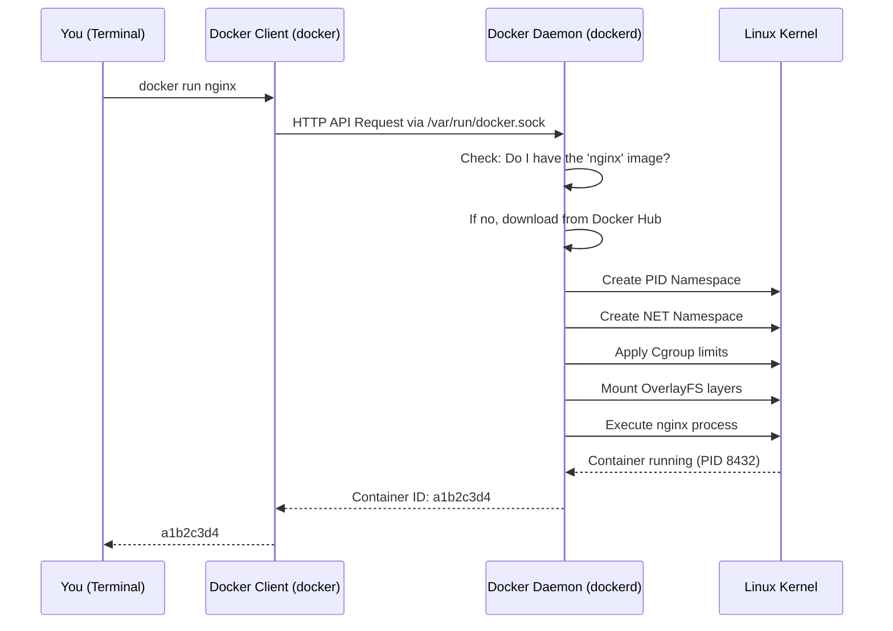

#### The Docker Daemon (`dockerd`) — The Chef
A **daemon** in Linux is a program that runs silently in the background, 24/7, waiting for someone to give it a job.

The Docker Daemon is the **Head Chef** in a restaurant kitchen:
*   **The Heavy Lifter:** It is the *only* part of Docker that knows how to talk to the Linux Kernel. It creates Namespaces, writes Cgroup rules, and mounts OverlayFS layers.
*   **The Manager:** It manages all Docker Objects (Images, Containers, Networks, Volumes) — downloading, creating, monitoring, stopping, and deleting them.
*   **The Server:** It listens for requests on a special communication channel (a UNIX socket at `/var/run/docker.sock`). It just listens 24/7, waiting for orders.

#### The Docker Client (`docker`) — The Waiter
When you type `docker run` or `docker build` in your terminal, you are using the Docker Client.

*   **The Messenger:** The Client's only job is to take your command, translate it into an HTTP API request, and send it to the Docker Daemon.
*   **Remote Control:** Because the Client and Daemon are separate, you can have your Client on your Windows laptop controlling a Daemon on a Linux server thousands of miles away.

#### Docker Objects — The Products
The things the Docker Daemon creates and manages are called **Docker Objects**:
1.  **Images:** The read-only blueprints.
2.  **Containers:** The running instances built from those blueprints.
3.  **Networks:** The virtual ethernet cables connecting containers.
4.  **Volumes:** The virtual hard drives for persistent data.

When you run `docker image ls` or `docker container ls`, you are asking the Daemon: *"Show me all the objects of this type in your warehouse."*

---

### 3. The Docker Image (In Detail)

An Image is **Code at Rest** — the frozen blueprint.

#### What EXACTLY Is a Docker Image?
The biggest misconception is that an Image contains a full Operating System. **It does not.**

Because containers use the Host's Linux Kernel, a Docker Image does not contain a kernel, bootloaders, or hardware drivers. It only contains the **User Space**.

Physically, if you were to take a Docker Image and unzip it on your laptop, you would just see a normal folder containing:
1.  A folder called `bin` (containing files like `ls` and `bash`)
2.  A folder called `etc` (containing configuration files)
3.  A small `.json` file containing the instructions (metadata)

**A Docker Image is literally just a compressed `.tar` archive containing a pre-packaged filesystem.**

#### What Does an Image Contain?

| Component | Description | Example |
|-----------|-------------|---------|
| **Base Root Filesystem** | The minimal OS user-space files (`/bin`, `/etc`, `/usr`). Not a kernel! | Alpine (5MB) or Debian (120MB) |
| **Application & Dependencies** | The software you specifically installed on top of the base. | NGINX binaries, PHP, MariaDB |
| **Image Metadata** | Embedded JSON telling Docker *how* to run the container. | Default command, env vars, exposed ports |

#### Why Doesn't It Use the Host's Files?
Three critical reasons:
1.  **Portability ("It Works On My Machine"):** By packaging its *own* files, the container runs identically on any computer in the world.
2.  **No Dependency Hell:** You can run PHP 5 in one container and PHP 8 in another on the same host, because each container has its own isolated `/usr/bin/php`.
3.  **Security:** If a container used the host's files, a hacker who breached NGINX could read your SSH keys and personal files. The MNT Namespace + its own filesystem keeps it trapped.

#### Why Is It Called an "Image"?
The term comes from "Disk Image" (like an ISO file). It means a **frozen, read-only snapshot of a filesystem**.

#### How the Layer Cake Works
An image is not one giant file. It is a stack of **read-only layers**. Every instruction in a Dockerfile creates a new layer:

```dockerfile
FROM debian:bullseye        # Layer 1: Base OS filesystem
RUN apt-get install nginx   # Layer 2: NGINX binaries added
COPY nginx.conf /etc/nginx/ # Layer 3: Your config file added
```

**Layer Caching:** If you build two images that both start with `FROM debian:bullseye`, Docker stores that base layer **only once** on your hard drive and shares it between both images!

---

### 4. The Docker Container (In Detail)

A Container is **Code in Motion** — the running house built from the blueprint.

#### The Birth of a Container
When you tell Docker to run an Image, the Docker Daemon does exactly three things simultaneously:

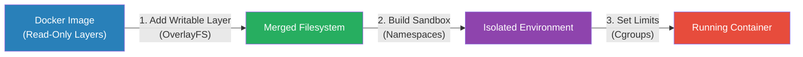

1.  **Adds a Writable Layer (OverlayFS):** The Image is read-only. The Daemon places an empty, writable layer on top and merges them. Any new files the application creates go into this layer.
2.  **Builds the Sandbox (Namespaces):** Creates PID, NET, MNT, UTS, IPC, and USER namespaces to isolate the process.
3.  **Sets the Limits (Cgroups):** Applies resource constraints so the container can't consume 100% of the host's CPU or RAM.

Once done, the Daemon executes the default command inside that sandbox. You now have a living Container!

#### The Golden Rule: Containers Are Ephemeral
"Ephemeral" means **temporary** or **disposable**.

The only thing unique to a Container is that thin Writable Layer. Containers are not pets; they are cattle.
*   If your NGINX container crashes, don't try to fix it. Delete it (`docker rm`) and start a new one (`docker run`). It takes milliseconds.
*   **The Danger:** When you delete a Container, the Writable Layer is instantly, permanently destroyed. All logs, changes, and data vanish.
*   **The Solution:** This is exactly why we need **Docker Volumes** (Module 3). Volumes live outside the container's Writable Layer, so they survive container deletion.

---

### 5. The Dockerfile

The Dockerfile is a simple, plain-text file named `Dockerfile` (with no file extension). It contains a list of instructions that the Docker Daemon reads from top to bottom. **Every single instruction creates a new, permanent read-only layer in your Image** (via OverlayFS).

When you build the Inception project, you will write three distinct Dockerfiles: one for MariaDB, one for WordPress, and one for NGINX.

#### The Core Instructions

##### `FROM` — The Foundation
Every Dockerfile **must** start with `FROM`. This tells Docker which existing image to use as the base layer.
*   **Example:** `FROM debian:bullseye`
*   The Docker Daemon downloads this base filesystem from the internet (Docker Hub) if it doesn't already have it locally.

##### `RUN` — The Installer
Executes a command *during the build process*. This is where you install software using a package manager.
*   **Example:** `RUN apt-get update && apt-get install -y nginx`
*   Each `RUN` creates a new OverlayFS layer. The Daemon runs the command, then freezes the resulting filesystem changes into a read-only layer.

##### `COPY` — Bringing Your Files In
Takes files from your Host Machine and permanently freezes them into a layer inside the Image.
*   **Example:** `COPY ./conf/nginx.conf /etc/nginx/nginx.conf`
*   *(There is also `ADD`, which can extract `.tar` files and download from URLs. Best practice: stick to `COPY` unless you explicitly need those features.)*

##### `EXPOSE` — The Documentation Label
Tells the Docker Daemon that the container will listen on a specific port at runtime.
*   **Example:** `EXPOSE 443`
*   **Crucial Detail:** `EXPOSE` does **NOT** actually open the port to the Host OS or the internet! It is purely metadata — documentation for the person reading the Dockerfile. You still have to map the ports in your `docker-compose.yml`.

##### `CMD` and `ENTRYPOINT` — The Spark of Life
Both define the default command that executes when the container starts (this command becomes PID 1).
*   **`CMD`:** Provides default arguments. If a user runs `docker run my_image bash`, the `bash` overrides whatever is in `CMD`.
*   **`ENTRYPOINT`:** Sets the executable that *must* run. It is very difficult for a user to override from the command line.
*   *Inception Tip:* You will likely use `ENTRYPOINT` to point to a custom shell script (e.g., `ENTRYPOINT ["/init.sh"]`), which does setup work before starting your actual server.

#### Summary Table

| Instruction | Purpose | Creates a Layer? |
|-------------|---------|:----------------:|
| `FROM` | Defines the base image (the bottom layer) | ✅ |
| `RUN` | Executes commands during build (e.g., `apt-get install`) | ✅ |
| `COPY` | Copies files from your host into the image | ✅ |
| `EXPOSE` | Documents which port the container listens on (metadata only) | ❌ |
| `CMD` | Default command when the container starts | ❌ |
| `ENTRYPOINT` | Like CMD, but harder to override | ❌ |

#### Shell Form vs. Exec Form (Critical for PID 1!)

The way you format your `CMD` or `ENTRYPOINT` instruction drastically changes how the Linux Kernel handles your process.

**❌ Shell Form (The Wrong Way)**
If you write your instruction like a normal terminal command (without brackets):
```dockerfile
CMD nginx -g "daemon off;"
```
Docker secretly wraps your command in a shell. It actually runs: `/bin/sh -c "nginx -g 'daemon off;'"`.
*   **Result:** The shell (`/bin/sh`) becomes PID 1. NGINX becomes PID 2.
*   **Problem:** When `docker stop` sends `SIGTERM` to PID 1 (`/bin/sh`), the shell ignores it. The container hangs for 10 seconds and is then brutally murdered (`SIGKILL`).

**✅ Exec Form (The Right Way)**
If you write your instruction using a JSON array (with brackets and quotes):
```dockerfile
CMD ["nginx", "-g", "daemon off;"]
```
Docker does *not* use a shell wrapper. It executes your command directly.
*   **Result:** NGINX becomes PID 1.
*   **Solution:** NGINX catches `SIGTERM`, gracefully closes connections, and exits cleanly.

| | Exec Form ✅ | Shell Form ❌ |
|---|---|---|
| **Syntax** | `CMD ["nginx", "-g", "daemon off;"]` | `CMD nginx -g "daemon off;"` |
| **What actually runs as PID 1** | `nginx` (your application) | `/bin/sh -c "nginx ..."` (a shell wrapper) |
| **Receives `SIGTERM`?** | ✅ Yes, directly | ❌ No, the shell swallows it |
| **`docker stop` works?** | ✅ Graceful shutdown | ❌ Hangs 10s, then `SIGKILL` |

**Always use Exec Form.**

#### The `latest` Tag is Forbidden
When you write `FROM debian`, Docker implicitly pulls `debian:latest`. The `latest` tag is a moving target — it changes every time Debian releases an update. This makes your builds non-reproducible. The Inception subject explicitly forbids it. Always pin a specific version: `FROM debian:bullseye`.

#### Best Practices: Layer Optimization
Because every `RUN` creates a new OverlayFS layer, you should chain commands with `&&` to keep image sizes small:

```dockerfile
# BAD — Creates 3 layers, and the cleanup in Layer 3 can't shrink Layers 1-2:
RUN apt-get update
RUN apt-get install -y nginx
RUN rm -rf /var/lib/apt/lists/*

# GOOD — Creates 1 optimized layer where the cleanup actually reduces size:
RUN apt-get update && \
    apt-get install -y nginx && \
    rm -rf /var/lib/apt/lists/*
```

---

### 6. Build Context & `.dockerignore`

This concept ties directly back to the **Client-Server architecture** we learned earlier.

#### What is the "Build Context"?
When you run `docker build -t my_nginx_image .`, that little dot `.` at the end is the **Build Context**. It tells the Docker Client: *"Here is the folder containing all the files you might need for this build."*

#### The Client-Server Problem
The Docker Client doesn't build the image — the Docker Daemon does. Before the Client sends the build request, it takes the **entire Build Context** (every file and folder in that `.` directory), compresses it into a massive archive, and ships it over to the Daemon.

#### The Danger of a Dirty Build Context
Imagine your project folder contains:
*   Your `Dockerfile` (1 KB)
*   Your `init.sh` script (2 KB)
*   A `.git` folder (50 MB)
*   A massive backup database dump `old_database.sql` (2 GB)

If you type `docker build .`, the Client will attempt to send all **2+ Gigabytes** to the Daemon. Your build "hangs" for minutes before the first Dockerfile instruction even starts. Even worse, if you use `COPY . /app` in your Dockerfile, that 2GB dump ends up permanently frozen inside your Image.

#### The Solution: `.dockerignore`
A plain-text file placed next to your Dockerfile. It works exactly like `.gitignore`:

```text
.git
*.sql
test_images/
README.md
```

Now when you run `docker build .`, the Client checks `.dockerignore` first, skips the ignored files, and only sends the tiny configuration files to the Daemon. The build starts instantly.

**Defense Answer:** *"The `.dockerignore` prevents the Docker Client from sending unnecessary files (like `.git` or test data) to the Daemon during the build, which speeds up the build and prevents accidental image bloat via `COPY`."*

---

### 7. The PID 1 Problem in Containers

This is the single most important concept for the Inception project. The 42 subject dedicates an entire paragraph to warning you about it.

#### The Golden Rule
**A container only stays alive as long as its PID 1 process is running.** The millisecond PID 1 exits, the container instantly shuts down.

#### The Anatomy of a Container Crash (Why Beginners Use Hacky Patches)
Imagine a student writes a bash script `init.sh` to configure and start MariaDB:
```bash
#!/bin/bash
service mysql start   # Starts the database in the BACKGROUND (as a daemon)
echo "Database started!"
# Script finishes here and exits
```
They set `ENTRYPOINT ["/init.sh"]` in their Dockerfile.

**What happens:**
1. Docker runs `/init.sh`. The script becomes PID 1.
2. The script starts MySQL in the background (MySQL becomes PID 2).
3. The script prints "Database started!" and reaches the end of the file.
4. PID 1 exits. **Docker instantly kills the entire container**, taking background MySQL down with it.

The student googles the problem and finds a terrible StackOverflow answer: add `tail -f /dev/null`:
```bash
#!/bin/bash
service mysql start
tail -f /dev/null   # Script is now trapped in an infinite loop!
```

The container stays alive! But they've created a ticking time bomb.

#### Why `tail -f` is Banned (Three Reasons)

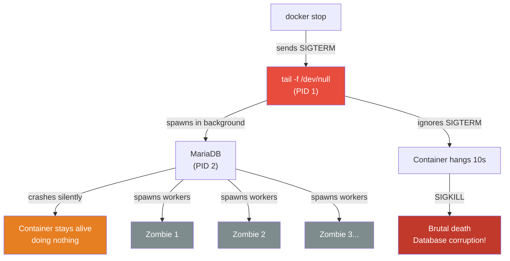

1.  **It breaks `docker stop` (The Signal Problem):** Docker sends `SIGTERM` to PID 1 (`tail -f`). As PID 1, it gets special kernel protection and ignores the signal. The container hangs for 10 seconds, then gets `SIGKILL`. If MariaDB was mid-write, the database is **corrupted**.
2.  **It creates Zombies (The Reaper Problem):** If MariaDB spawns sub-processes that die, PID 1 must reap them. `tail -f` doesn't know how to reap zombies. Over time, the container fills with dead processes until it crashes.
3.  **It masks application crashes:** If MariaDB crashes in the background, the container *should* die so Docker can restart it (via `restart: always`). But `tail -f` keeps PID 1 alive, so Docker thinks everything is fine while the database is completely dead.

#### The Correct Solution: Foreground Processes
Run your actual application in the **foreground** as PID 1. Tell the application *not* to daemonize:

| Service | Foreground Flag | What It Does |
|---------|----------------|--------------|
| **NGINX** | `daemon off;` | Prevents NGINX from forking into the background |
| **PHP-FPM** | `-F` or `--nodaemonize` | Keeps PHP-FPM in the foreground |
| **MariaDB** | `mysqld_safe` or `mysqld` | Runs the database server directly (not via `service`) |

By doing this:
1.  Your application *is* PID 1 and handles `SIGTERM` gracefully.
2.  If your application crashes, PID 1 dies, the container stops, and Docker Compose immediately restarts it.
3.  Professional applications (NGINX, MariaDB, PHP-FPM) are designed to catch signals and shut down databases safely.

---

## Module 3: The Orchestration Layer

*Managing a single container is easy. Managing multiple containers that need to talk to each other and share data requires orchestration tools like Docker Compose.*

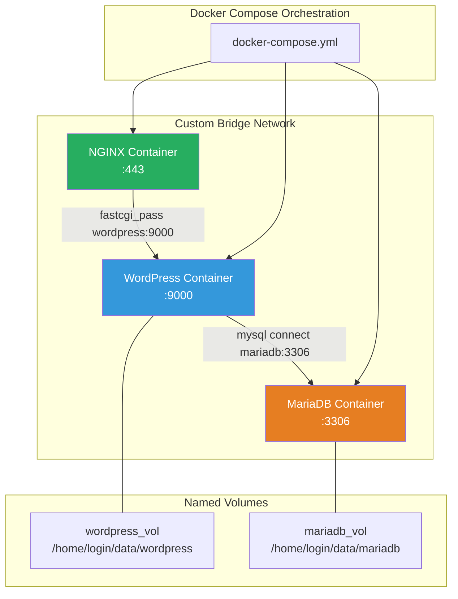

### 1. Docker Compose

*   **Declarative Infrastructure:** Instead of typing long `docker run` commands in the terminal, you write a `docker-compose.yml` file that declares what your entire infrastructure should look like.
*   **Services & Dependencies:** You define multiple "services" (e.g., database, web server). You can define dependencies (e.g., WordPress `depends_on` MariaDB), ensuring containers start in the correct order.
*   **Service Readiness vs. Start Order:** `depends_on` only guarantees the container has *started*, not that the service inside it is *ready* to accept connections. MariaDB might take 5 seconds to initialize after starting. If WordPress tries to connect during those 5 seconds, it will crash. The solution is to use a **wait loop** in your entrypoint script that checks if MariaDB is accepting connections before proceeding.

### 2. Docker Networks

*   **Bridge Networks:** Docker creates virtual network switches. By creating a custom network in Docker Compose, all your containers are attached to it and can communicate securely.
*   **DNS Resolution:** Docker provides an internal DNS server. The NGINX container can reach the WordPress container simply by using the service name `wordpress` as a hostname. No IP addresses needed.
*   **Why `--link` and `host` network are Forbidden:** `--link` is a legacy mechanism that is static and fragile. `network: host` removes the NET Namespace entirely — defeating the purpose of isolation. The project requires custom bridge networks.

### 3. Docker Volumes

*   **Ephemeral vs. Persistent Storage:** By default, data written inside a container is ephemeral; when the container is deleted, the data is gone forever.
*   **Named Volumes:** Docker manages a storage area on the host machine. You mount this volume into a container. If the container dies, the volume and its data persist.
*   **Bind Mounts:** You explicitly tell Docker to mount a specific folder on your host machine into the container. The Inception subject forbids bind mounts for the two main volumes.
*   **Volume Driver Options:** The Inception subject requires named volumes to store data at `/home/login/data` on the host. Configure volumes in `docker-compose.yml` using `driver_opts` with `type: none`, `o: bind`, and `device: /home/login/data/...`.

### 4. Environment Variables & Secrets

*   **Parameterizing Containers:** Images should be generic. Inject configuration at runtime using environment variables.
*   **`.env` Files:** Docker Compose reads a `.env` file and injects variables into your containers.
*   **Docker Secrets:** More secure than env vars. Secrets are mounted as files at `/run/secrets/<secret_name>`. Unlike env vars, secrets don't appear in `docker inspect` output. The Inception subject strongly recommends using secrets for all passwords and credentials.
*   **Security Rules:** Never hardcode passwords in a Dockerfile. Never commit `.env` or secret files to Git. Credentials in the Git repository = **automatic project failure**.

### 5. Container Restart Policies

The Inception subject states: *"Your containers have to restart in case of a crash."*

| Policy | Behavior |
|--------|----------|
| `restart: always` | Always restarts, even after host reboot. |
| `restart: on-failure` | Only restarts on non-zero (error) exit code. |
| `restart: unless-stopped` | Like `always`, but stays stopped if you manually `docker stop` it. |

---

## Module 4: The Application Stack (LEMP)

*How the specific technologies requested by the Inception subject interact to serve a website.*

### The Full Request Flow

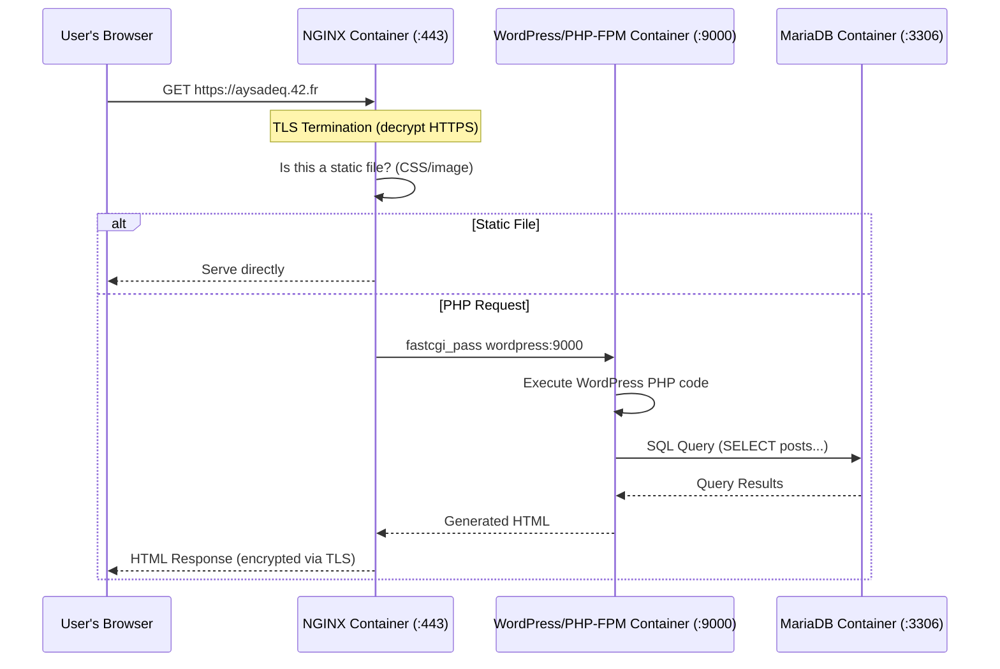

### 1. The LEMP Architecture Overview

*   **L**inux (The OS/Container base)
*   **E**Nginx (Web Server)
*   **M**ariaDB (Database)
*   **P**HP-FPM (Application Logic)

### 2. NGINX (The Web Server)

*   **Static vs. Dynamic Content:** NGINX is excellent at directly serving static files (images, CSS, HTML). It cannot execute PHP code by itself.
*   **Reverse Proxy:** When a user requests a PHP file, NGINX acts as a middleman, proxying the request to the PHP-FPM container on port `9000` using the `fastcgi_pass` directive.

### 3. TLS/SSL (HTTPS)

*   **What is TLS?** Transport Layer Security encrypts the communication between the user's browser and the server, preventing anyone from eavesdropping on the data.
*   **Certificates and Keys:** TLS requires two files: a **certificate** (the public identity card that tells the browser "I am aysadeq.42.fr") and a **private key** (the secret used to encrypt and decrypt traffic). They are generated together as a pair.
*   **Self-Signed vs. CA-Signed:** A Certificate Authority (CA) like Let's Encrypt signs certificates that browsers trust automatically. For this project, we generate **self-signed** certificates using `openssl`. The browser will show a warning, but the encryption itself is identical.
*   **TLSv1.2 and TLSv1.3:** The Inception subject mandates these versions only. Older versions (TLSv1.0, TLSv1.1, SSLv3) have known security vulnerabilities and must be disabled.
*   **Port 443:** NGINX must be the only entrypoint into the infrastructure, listening exclusively on port `443`.

### 4. MariaDB (The Database)

*   **Relational Databases:** Data is stored in structured tables linked together by relationships.
*   **Storage Mechanisms:** The actual database files will be stored in our Docker Volume to ensure persistence.
*   **User Security:** We must configure a root password and create a dedicated, non-root user specifically for WordPress to use when connecting. The root account should not be accessible remotely.

### 5. PHP-FPM (FastCGI Process Manager)

*   **What is it?** A daemon that runs in the background waiting for PHP execution requests.
*   **How it works:** When NGINX forwards a request via the FastCGI protocol, PHP-FPM spins up a worker process to compile and execute the PHP scripts, then returns the raw HTML output to NGINX.
*   **Configuration:** PHP-FPM must be configured to listen on port `9000` (via a TCP socket) so that the NGINX container (on a separate network namespace) can reach it.

### 6. WordPress

*   **The CMS:** A robust Content Management System built on PHP.
*   **`wp-config.php`:** The critical configuration file where WordPress learns the hostname of the MariaDB container, the database name, and the user credentials. We will generate this dynamically using our environment variables.
*   **WP-CLI:** A command-line tool for managing WordPress without a browser. In our entrypoint script, we will use WP-CLI to download WordPress core files, create the `wp-config.php`, run the installation, and create the required users (including an admin user whose name must not contain "admin").
*   **Two Required Users:** The Inception subject requires at least two users in the WordPress database. One is an administrator (with a non-obvious username), and the other is a regular user/editor.

### 7. Domain Name Configuration

*   **The Requirement:** The Inception subject requires your domain `aysadeq.42.fr` to point to your local IP address.
*   **`/etc/hosts` File:** Instead of buying a real domain, you edit the `/etc/hosts` file on the host machine to add `127.0.0.1 aysadeq.42.fr`. This tells the OS to resolve that domain locally without querying the internet.
*   **Why this works:** When the browser tries to load `https://aysadeq.42.fr`, the OS checks `/etc/hosts` first, finds the mapping to `127.0.0.1`, and sends the request to your own machine where Docker's port mapping forwards it into the NGINX container.
