# Inception Learning Guide

This guide is designed to take you from foundational operating system concepts all the way to understanding the complex interactions of a multi-container web architecture. It is broken down into four modules, ensuring every major concept is explained in detail.

> **The One-Sentence Summary:** A container is just a normal Linux process that the kernel is **lying to** (Namespaces), **restricting** (Cgroups), and running on a **layered, shared filesystem** (OverlayFS).

---

## Module Overview

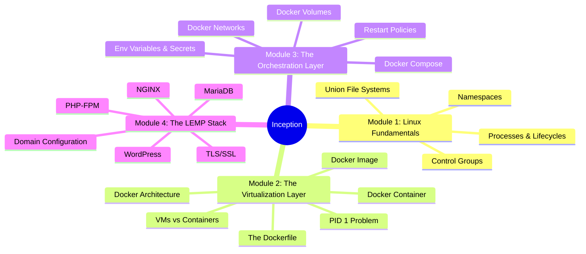

---

## Module 1: Linux & Operating System Fundamentals

*Understanding the Linux operating system is the key to truly grasping how containers work under the hood. Containers are not magic; they are just isolated Linux processes.*

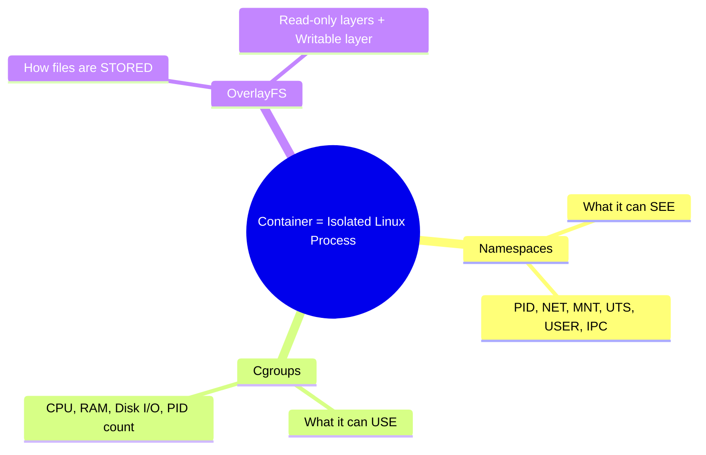

### 1. Processes and Lifecycles

#### What is a Process?
Imagine you have an executable file on your hard drive, like `/bin/bash` or `/usr/sbin/nginx`. Right now, that file is just dormant code sitting on a disk. It is doing nothing.
*   **A program** is code at rest.
*   **A process** is code in motion.

When you execute that program, the Linux kernel loads it into RAM, assigns it CPU time, and gives it a unique ID number called a **PID (Process ID)**. The kernel also keeps track of its environment variables, the files it has open, and its current state.

**In the context of containers:** When you run a Docker container, you are literally just telling the host's Linux kernel to start a process, but you are wrapping that process in Namespaces and Cgroups to isolate it.

#### The Process Tree and PID 1
Processes in Linux reproduce like a family tree. A process cannot magically appear; it must be spawned by an existing process.

When a process wants to create a child, it performs a system call called `fork()`, which creates an exact clone of itself, followed by `exec()`, which replaces the clone's memory with a new program.
*   If process A (PID 100) spawns process B, Process A is the **Parent**, and Process B (PID 101) is the **Child**.

When a standard Linux computer boots up, the kernel starts the very first process. This process is assigned **PID 1**. On modern Linux systems, PID 1 is usually a program called `systemd` or `init`. PID 1 is the great-grandfather of every single process on your computer.

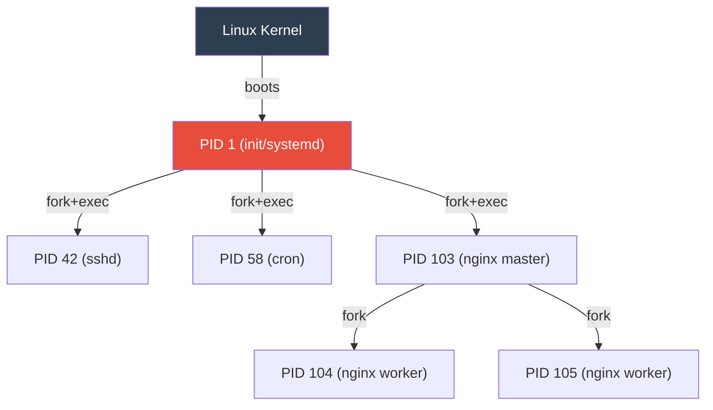

**The Container Context (The PID 1 Problem):**
Because a container has an isolated PID Namespace, it gets its own brand new process tree. When you write a Dockerfile and use the `CMD` or `ENTRYPOINT` instruction (e.g., `CMD ["nginx", "-g", "daemon off;"]`), **that specific command becomes PID 1 inside the container.** But PID 1 has special responsibilities (see Zombies and Orphans below).

#### Process States and Signals
Processes don't run continuously. The kernel rapidly switches them between states (Running, Sleeping, Stopped).

When you (or the OS) want to communicate with a process, you send it a **Signal**:
*   **`SIGTERM` (Signal 15):** A polite request. "Please wrap up what you are doing, save your data, and shut down." The process can catch this signal and run cleanup code.
*   **`SIGKILL` (Signal 9):** A shotgun. Goes straight to the kernel. The process is instantly annihilated. It cannot be caught or ignored.

**The Container Context:**
When you type `docker stop <container>`, Docker sends `SIGTERM` to **PID 1** inside the container. It waits 10 seconds. If the container hasn't stopped, it murders it with `SIGKILL`.

**The catch:** The Linux kernel gives special protection to PID 1. By default, PID 1 ignores `SIGTERM` unless the program was specifically coded to handle it. If your Dockerfile runs a simple bash script that doesn't handle signals, `docker stop` will hang for 10 seconds every time, then force a `SIGKILL`, which can corrupt databases!

#### Zombies and Orphans
When a child process finishes running, it dies. However, it leaves behind a tiny data structure (an exit status) so its parent can check if it succeeded or failed.
*   **Zombie:** A process that is dead, but its parent hasn't collected its exit status yet. It sits around consuming an entry in the process table.
*   **Orphan:** If a parent process crashes and dies before its child process finishes, the child becomes an Orphan.

**The Reaper (PID 1's most important job):**
An Orphan process is immediately adopted by **PID 1**. PID 1's sacred duty is to periodically "reap" (collect the exit statuses of) dead children and clear them out of the process table.

**The Container Context:**
Your application (like a bash script or `tail -f`) is PID 1 in a container. If your application spawns child processes (which NGINX, PHP-FPM, and bash scripts do constantly), and those children die, your application is now responsible for reaping them.
*   Does `tail -f /dev/null` know how to reap zombie processes? **No.**
*   Does `sleep infinity` know how to reap zombies? **No.**

This is exactly why the 42 subject forbids `tail -f` and infinite loops!

---

### 2. Namespaces

#### What is a Namespace?
Normally, any process running on a Linux machine has a global view of the system. It can see every hard drive mounted, every network interface, and every other process running.

A **Namespace** is a feature of the Linux kernel that takes a specific resource (like the network or the process list) and partitions it. When a process is placed inside a namespace, its vision is restricted. It can *only* see the resources associated with that specific namespace. It has no idea the rest of the computer exists.

Docker didn't invent this! Namespaces have been a part of the Linux kernel since 2002. Docker just made them easy to use.

#### The 6 Core Namespaces

When Docker creates a container, it wraps the process in all six namespaces simultaneously:

| Namespace | The Lie Docker Tells the Process | Reality |
|-----------|----------------------------------|---------|
| **PID** | "You are PID 1, the only process running." | It's actually PID 8432 on the host. The kernel maps the real PID to a fake one. |
| **NET** | "You have your own network card and IP address." | The host has one physical NIC. Docker creates virtual interfaces inside the namespace. |
| **MNT** | "You have your own hard drive starting at `/`." | The process can't see the host's files. A specific folder on the host is presented as the root filesystem. |
| **UTS** | "Your hostname is `wordpress`." | The host's real hostname is `aysadeq-laptop`. The container gets its own identity. |
| **IPC** | "You can only talk to processes in your own bubble." | Prevents the container from peeking into the shared memory of host processes. |
| **USER** | "You are the all-powerful root user." | The kernel maps container root to an unprivileged user on the host. |

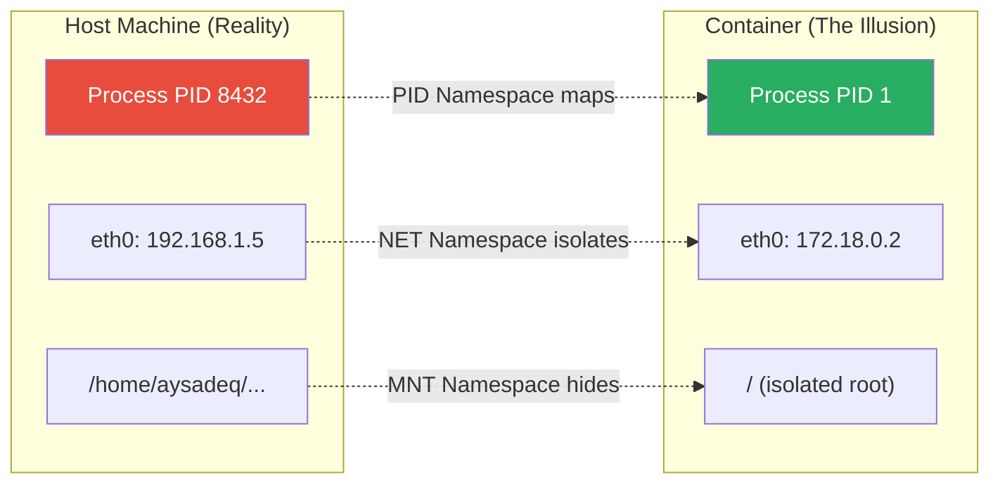

#### Tying it to the Inception Project
*   When you declare a `networks:` block in your compose file, Docker creates a custom **NET Namespace** bridge and plugs all your containers into it.
*   When you declare your `mariadb` and `wordpress` services, they get unique hostnames via the **UTS Namespace**, allowing WordPress to connect to the database simply by querying the name `mariadb`.
*   Because of the **MNT Namespace**, your containers cannot see the host's files. That is *why* the subject requires you to explicitly use **Volumes** — you are telling Docker to punch a small, controlled hole through the MNT namespace.

---

### 3. Control Groups (Cgroups)

If Namespaces are the walls that isolate a container, **Cgroups are the bouncer at the door.**

Namespaces dictate what a container can *see*. Cgroups dictate what a container can *use*.

#### What is a Cgroup?
Control Groups were developed by engineers at Google in 2006 and merged into the Linux kernel shortly after.

Without Cgroups, a buggy container with a memory leak could consume 100% of the host's RAM and crash the entire server, taking down every other container with it. This is called the **"Noisy Neighbor Problem."**

#### What Can Cgroups Limit?

| Resource | How it Limits | What Happens on Violation |
|----------|--------------|---------------------------|
| **Memory (RAM)** | Max allocation (e.g., 512MB) | The kernel's **OOM Killer** sends `SIGKILL` instantly. Container exits with code `137`. |
| **CPU** | Max cores or time percentage | The kernel **throttles** the process (pauses it briefly). It doesn't get killed, just slowed down. |
| **Block I/O** | Max disk read/write speed | Caps disk throughput (e.g., 10MB/s) so other containers can still access the disk. |
| **PID Count** | Max number of processes | Prevents fork bombs. If the container tries to spawn process #51 (with limit 50), the kernel denies it. |

#### How Docker uses Cgroups
Behind the scenes, Docker just navigates to a special folder on your host machine (`/sys/fs/cgroup/`) and writes text files. To limit memory, Docker literally echoes the number "536870912" (512MB in bytes) into a file called `memory.limit_in_bytes` assigned to your container's process tree.

---

### 4. Union File Systems (OverlayFS)

If Namespaces isolate the process, and Cgroups limit its resources, **OverlayFS is what makes the container lightweight and blazingly fast.**

#### The Problem with Virtual Machines
When you create a VM, you allocate a massive chunk of your hard drive (e.g., 20GB) to it. 10 NGINX VMs = **200GB** of space. And 95% of the files in those 10 VMs are identical (the core OS files, the NGINX binaries). A colossal waste.

#### How OverlayFS Works
OverlayFS takes multiple directories on your host machine and stacks them on top of each other, presenting a single, unified view. Imagine stacking sheets of transparent glass, each with some writing on it.

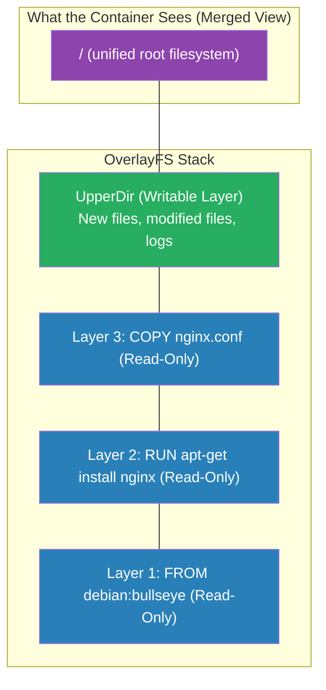

*   **LowerDir (Read-Only):** This is the Docker Image. Completely immutable. If you run 10 containers, they all point to the **exact same** LowerDir on your hard drive. Zero wasted space.
*   **UpperDir (Writable):** A brand new, empty directory created specifically for your running container. The **only** writable part.
*   **Merged View:** What the container actually sees. The kernel overlays the layers and presents them as the root filesystem (`/`).

#### Copy-on-Write (CoW)
What happens if the container needs to modify a file from a read-only layer (like editing `/etc/nginx/nginx.conf`)?

1.  **Read:** The container wants to edit the file.
2.  **Copy:** OverlayFS silently copies that file from the LowerDir up into the writable UpperDir.
3.  **Write:** The container modifies the copy in the UpperDir.
4.  **Hide:** The modified file in the UpperDir now "masks" the original in the LowerDir.

The original image is never touched. If a container *deletes* a file from the LowerDir, OverlayFS creates a special **"whiteout" file** in the UpperDir to hide it.

---

## Module 2: The Virtualization Layer

*Building on Linux fundamentals, this module explores how Docker leverages Namespaces, Cgroups, and UnionFS to create lightweight containers.*

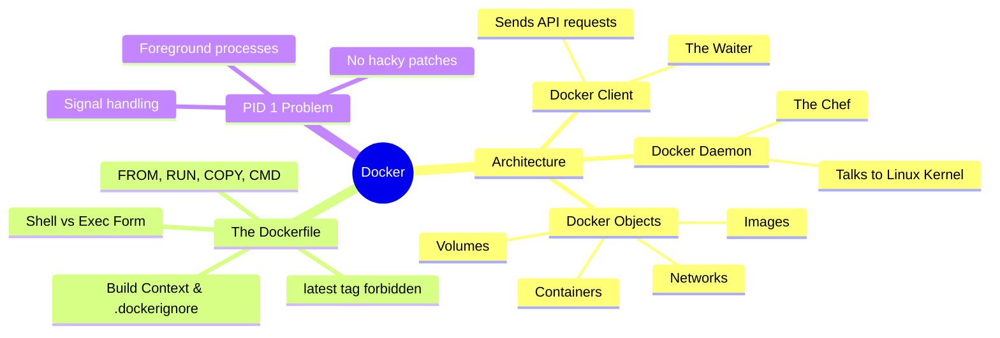

### 1. Virtual Machines vs. Containers

#### The VM Stack (Heavy)
```
┌─────────────────────┐
│   Your Application  │
├─────────────────────┤
│   Bins/Libs/Deps    │
├─────────────────────┤
│  Guest OS (Full     │  ← Entire kernel + OS (GBs of space)
│  Linux Kernel!)     │  ← Takes minutes to boot
├─────────────────────┤
│  Hypervisor         │  ← VirtualBox / VMware
│  (VirtualBox)       │
├─────────────────────┤
│  Host OS            │
├─────────────────────┤
│  Physical Hardware  │
└─────────────────────┘
```

#### The Container Stack (Lightweight)
```
┌─────────────────────┐
│   Your Application  │
├─────────────────────┤
│   Bins/Libs/Deps    │  ← Only user-space files (MBs)
│   (Alpine/Debian)   │  ← Starts in milliseconds
├─────────────────────┤
│   Docker Engine     │  ← Uses Namespaces + Cgroups
├─────────────────────┤  ← NO Hypervisor! NO Guest OS!
│   Host OS (shares   │
│   its kernel)       │
├─────────────────────┤
│   Physical Hardware │
└─────────────────────┘
```

#### The Inception Paradox: Why Containers Inside a VM?
Evaluators will ask: *"If containers are better than VMs, why are we using a VM?"*

**The Answer:** They solve two different problems; they are best friends, not enemies.
1.  **VMs provide hardware-level security and cross-platform compatibility.** Docker *requires* a Linux Kernel. If you are on Mac or Windows, you need a Linux VM first.
2.  **Containers provide application-level deployment speed and efficiency.** Once you have your Linux VM, you use containers to separate NGINX, WordPress, and MariaDB cleanly without spinning up three heavy VMs.

In the real world (AWS, Google Cloud), Docker containers almost always run on top of Virtual Machines.

---

### 2. Docker Architecture (Client-Server)

Docker is not one single program. It is a **Client-Server Architecture** with three components:

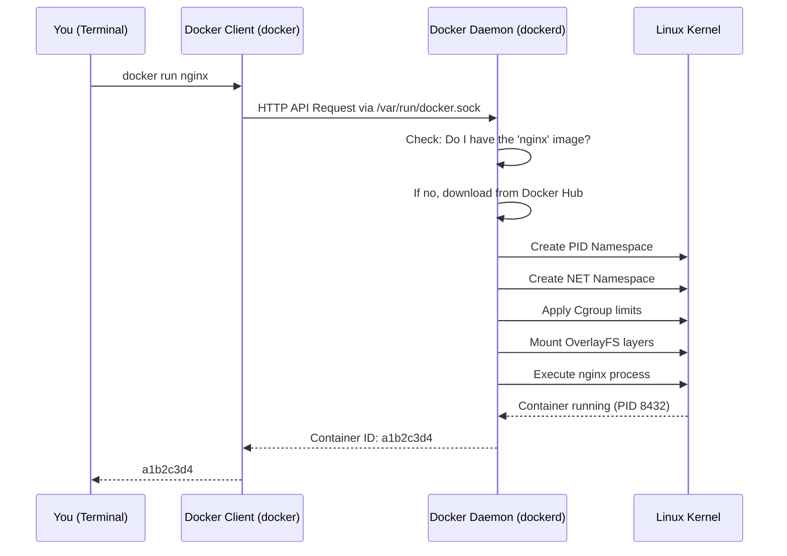

#### The Docker Daemon (`dockerd`) — The Chef
A **daemon** in Linux is a program that runs silently in the background, 24/7, waiting for someone to give it a job.

The Docker Daemon is the **Head Chef** in a restaurant kitchen:
*   **The Heavy Lifter:** It is the *only* part of Docker that knows how to talk to the Linux Kernel. It creates Namespaces, writes Cgroup rules, and mounts OverlayFS layers.
*   **The Manager:** It manages all Docker Objects (Images, Containers, Networks, Volumes) — downloading, creating, monitoring, stopping, and deleting them.
*   **The Server:** It listens for requests on a special communication channel (a UNIX socket at `/var/run/docker.sock`). It just listens 24/7, waiting for orders.

#### The Docker Client (`docker`) — The Waiter
When you type `docker run` or `docker build` in your terminal, you are using the Docker Client.

*   **The Messenger:** The Client's only job is to take your command, translate it into an HTTP API request, and send it to the Docker Daemon.
*   **Remote Control:** Because the Client and Daemon are separate, you can have your Client on your Windows laptop controlling a Daemon on a Linux server thousands of miles away.

#### Docker Objects — The Products
The things the Docker Daemon creates and manages are called **Docker Objects**:
1.  **Images:** The read-only blueprints.
2.  **Containers:** The running instances built from those blueprints.
3.  **Networks:** The virtual ethernet cables connecting containers.
4.  **Volumes:** The virtual hard drives for persistent data.

When you run `docker image ls` or `docker container ls`, you are asking the Daemon: *"Show me all the objects of this type in your warehouse."*

---

### 3. The Docker Image (In Detail)

An Image is **Code at Rest** — the frozen blueprint.

#### What EXACTLY Is a Docker Image?
The biggest misconception is that an Image contains a full Operating System. **It does not.**

Because containers use the Host's Linux Kernel, a Docker Image does not contain a kernel, bootloaders, or hardware drivers. It only contains the **User Space**.

Physically, if you were to take a Docker Image and unzip it on your laptop, you would just see a normal folder containing:
1.  A folder called `bin` (containing files like `ls` and `bash`)
2.  A folder called `etc` (containing configuration files)
3.  A small `.json` file containing the instructions (metadata)

**A Docker Image is literally just a compressed `.tar` archive containing a pre-packaged filesystem.**

#### What Does an Image Contain?

| Component | Description | Example |
|-----------|-------------|---------|
| **Base Root Filesystem** | The minimal OS user-space files (`/bin`, `/etc`, `/usr`). Not a kernel! | Alpine (5MB) or Debian (120MB) |
| **Application & Dependencies** | The software you specifically installed on top of the base. | NGINX binaries, PHP, MariaDB |
| **Image Metadata** | Embedded JSON telling Docker *how* to run the container. | Default command, env vars, exposed ports |

#### Why Doesn't It Use the Host's Files?
Three critical reasons:
1.  **Portability ("It Works On My Machine"):** By packaging its *own* files, the container runs identically on any computer in the world.
2.  **No Dependency Hell:** You can run PHP 5 in one container and PHP 8 in another on the same host, because each container has its own isolated `/usr/bin/php`.
3.  **Security:** If a container used the host's files, a hacker who breached NGINX could read your SSH keys and personal files. The MNT Namespace + its own filesystem keeps it trapped.

#### Why Is It Called an "Image"?
The term comes from "Disk Image" (like an ISO file). It means a **frozen, read-only snapshot of a filesystem**.

#### How the Layer Cake Works
An image is not one giant file. It is a stack of **read-only layers**. Every instruction in a Dockerfile creates a new layer:

```dockerfile
FROM debian:bullseye        # Layer 1: Base OS filesystem
RUN apt-get install nginx   # Layer 2: NGINX binaries added
COPY nginx.conf /etc/nginx/ # Layer 3: Your config file added
```

**Layer Caching:** If you build two images that both start with `FROM debian:bullseye`, Docker stores that base layer **only once** on your hard drive and shares it between both images!

---

### 4. The Docker Container (In Detail)

A Container is **Code in Motion** — the running house built from the blueprint.

#### The Birth of a Container
When you tell Docker to run an Image, the Docker Daemon does exactly three things simultaneously:

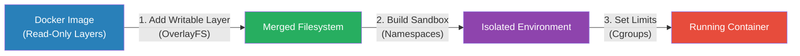

1.  **Adds a Writable Layer (OverlayFS):** The Image is read-only. The Daemon places an empty, writable layer on top and merges them. Any new files the application creates go into this layer.
2.  **Builds the Sandbox (Namespaces):** Creates PID, NET, MNT, UTS, IPC, and USER namespaces to isolate the process.
3.  **Sets the Limits (Cgroups):** Applies resource constraints so the container can't consume 100% of the host's CPU or RAM.

Once done, the Daemon executes the default command inside that sandbox. You now have a living Container!

#### The Golden Rule: Containers Are Ephemeral
"Ephemeral" means **temporary** or **disposable**.

The only thing unique to a Container is that thin Writable Layer. Containers are not pets; they are cattle.
*   If your NGINX container crashes, don't try to fix it. Delete it (`docker rm`) and start a new one (`docker run`). It takes milliseconds.
*   **The Danger:** When you delete a Container, the Writable Layer is instantly, permanently destroyed. All logs, changes, and data vanish.
*   **The Solution:** This is exactly why we need **Docker Volumes** (Module 3). Volumes live outside the container's Writable Layer, so they survive container deletion.

---

### 5. The Dockerfile

The Dockerfile is a simple, plain-text file named `Dockerfile` (with no file extension). It contains a list of instructions that the Docker Daemon reads from top to bottom. **Every single instruction creates a new, permanent read-only layer in your Image** (via OverlayFS).

When you build the Inception project, you will write three distinct Dockerfiles: one for MariaDB, one for WordPress, and one for NGINX.

#### The Core Instructions

##### `FROM` — The Foundation
Every Dockerfile **must** start with `FROM`. This tells Docker which existing image to use as the base layer.
*   **Example:** `FROM debian:bullseye`
*   The Docker Daemon downloads this base filesystem from the internet (Docker Hub) if it doesn't already have it locally.

##### `RUN` — The Installer
Executes a command *during the build process*. This is where you install software using a package manager.
*   **Example:** `RUN apt-get update && apt-get install -y nginx`
*   Each `RUN` creates a new OverlayFS layer. The Daemon runs the command, then freezes the resulting filesystem changes into a read-only layer.

##### `COPY` — Bringing Your Files In
Takes files from your Host Machine and permanently freezes them into a layer inside the Image.
*   **Example:** `COPY ./conf/nginx.conf /etc/nginx/nginx.conf`
*   *(There is also `ADD`, which can extract `.tar` files and download from URLs. Best practice: stick to `COPY` unless you explicitly need those features.)*

##### `EXPOSE` — The Documentation Label
Tells the Docker Daemon that the container will listen on a specific port at runtime.
*   **Example:** `EXPOSE 443`
*   **Crucial Detail:** `EXPOSE` does **NOT** actually open the port to the Host OS or the internet! It is purely metadata — documentation for the person reading the Dockerfile. You still have to map the ports in your `docker-compose.yml`.

##### `CMD` and `ENTRYPOINT` — The Spark of Life
Both define the default command that executes when the container starts (this command becomes PID 1).
*   **`CMD`:** Provides default arguments. If a user runs `docker run my_image bash`, the `bash` overrides whatever is in `CMD`.
*   **`ENTRYPOINT`:** Sets the executable that *must* run. It is very difficult for a user to override from the command line.
*   *Inception Tip:* You will likely use `ENTRYPOINT` to point to a custom shell script (e.g., `ENTRYPOINT ["/init.sh"]`), which does setup work before starting your actual server.

#### Summary Table

| Instruction | Purpose | Creates a Layer? |
|-------------|---------|:----------------:|
| `FROM` | Defines the base image (the bottom layer) | ✅ |
| `RUN` | Executes commands during build (e.g., `apt-get install`) | ✅ |
| `COPY` | Copies files from your host into the image | ✅ |
| `EXPOSE` | Documents which port the container listens on (metadata only) | ❌ |
| `CMD` | Default command when the container starts | ❌ |
| `ENTRYPOINT` | Like CMD, but harder to override | ❌ |

#### Shell Form vs. Exec Form (Critical for PID 1!)

The way you format your `CMD` or `ENTRYPOINT` instruction drastically changes how the Linux Kernel handles your process.

**❌ Shell Form (The Wrong Way)**
If you write your instruction like a normal terminal command (without brackets):
```dockerfile
CMD nginx -g "daemon off;"
```
Docker secretly wraps your command in a shell. It actually runs: `/bin/sh -c "nginx -g 'daemon off;'"`.
*   **Result:** The shell (`/bin/sh`) becomes PID 1. NGINX becomes PID 2.
*   **Problem:** When `docker stop` sends `SIGTERM` to PID 1 (`/bin/sh`), the shell ignores it. The container hangs for 10 seconds and is then brutally murdered (`SIGKILL`).

**✅ Exec Form (The Right Way)**
If you write your instruction using a JSON array (with brackets and quotes):
```dockerfile
CMD ["nginx", "-g", "daemon off;"]
```
Docker does *not* use a shell wrapper. It executes your command directly.
*   **Result:** NGINX becomes PID 1.
*   **Solution:** NGINX catches `SIGTERM`, gracefully closes connections, and exits cleanly.

| | Exec Form ✅ | Shell Form ❌ |
|---|---|---|
| **Syntax** | `CMD ["nginx", "-g", "daemon off;"]` | `CMD nginx -g "daemon off;"` |
| **What actually runs as PID 1** | `nginx` (your application) | `/bin/sh -c "nginx ..."` (a shell wrapper) |
| **Receives `SIGTERM`?** | ✅ Yes, directly | ❌ No, the shell swallows it |
| **`docker stop` works?** | ✅ Graceful shutdown | ❌ Hangs 10s, then `SIGKILL` |

**Always use Exec Form.**

#### The `latest` Tag is Forbidden
When you write `FROM debian`, Docker implicitly pulls `debian:latest`. The `latest` tag is a moving target — it changes every time Debian releases an update. This makes your builds non-reproducible. The Inception subject explicitly forbids it. Always pin a specific version: `FROM debian:bullseye`.

#### Best Practices: Layer Optimization
Because every `RUN` creates a new OverlayFS layer, you should chain commands with `&&` to keep image sizes small:

```dockerfile
# BAD — Creates 3 layers, and the cleanup in Layer 3 can't shrink Layers 1-2:
RUN apt-get update
RUN apt-get install -y nginx
RUN rm -rf /var/lib/apt/lists/*

# GOOD — Creates 1 optimized layer where the cleanup actually reduces size:
RUN apt-get update && \
    apt-get install -y nginx && \
    rm -rf /var/lib/apt/lists/*
```

---

### 6. Build Context & `.dockerignore`

This concept ties directly back to the **Client-Server architecture** we learned earlier.

#### What is the "Build Context"?
When you run `docker build -t my_nginx_image .`, that little dot `.` at the end is the **Build Context**. It tells the Docker Client: *"Here is the folder containing all the files you might need for this build."*

#### The Client-Server Problem
The Docker Client doesn't build the image — the Docker Daemon does. Before the Client sends the build request, it takes the **entire Build Context** (every file and folder in that `.` directory), compresses it into a massive archive, and ships it over to the Daemon.

#### The Danger of a Dirty Build Context
Imagine your project folder contains:
*   Your `Dockerfile` (1 KB)
*   Your `init.sh` script (2 KB)
*   A `.git` folder (50 MB)
*   A massive backup database dump `old_database.sql` (2 GB)

If you type `docker build .`, the Client will attempt to send all **2+ Gigabytes** to the Daemon. Your build "hangs" for minutes before the first Dockerfile instruction even starts. Even worse, if you use `COPY . /app` in your Dockerfile, that 2GB dump ends up permanently frozen inside your Image.

#### The Solution: `.dockerignore`
A plain-text file placed next to your Dockerfile. It works exactly like `.gitignore`:

```text
.git
*.sql
test_images/
README.md
```

Now when you run `docker build .`, the Client checks `.dockerignore` first, skips the ignored files, and only sends the tiny configuration files to the Daemon. The build starts instantly.

**Defense Answer:** *"The `.dockerignore` prevents the Docker Client from sending unnecessary files (like `.git` or test data) to the Daemon during the build, which speeds up the build and prevents accidental image bloat via `COPY`."*

---

### 7. The PID 1 Problem in Containers

This is the single most important concept for the Inception project. The 42 subject dedicates an entire paragraph to warning you about it.

#### The Golden Rule
**A container only stays alive as long as its PID 1 process is running.** The millisecond PID 1 exits, the container instantly shuts down.

#### The Anatomy of a Container Crash (Why Beginners Use Hacky Patches)
Imagine a student writes a bash script `init.sh` to configure and start MariaDB:
```bash
#!/bin/bash
service mysql start   # Starts the database in the BACKGROUND (as a daemon)
echo "Database started!"
# Script finishes here and exits
```
They set `ENTRYPOINT ["/init.sh"]` in their Dockerfile.

**What happens:**
1. Docker runs `/init.sh`. The script becomes PID 1.
2. The script starts MySQL in the background (MySQL becomes PID 2).
3. The script prints "Database started!" and reaches the end of the file.
4. PID 1 exits. **Docker instantly kills the entire container**, taking background MySQL down with it.

The student googles the problem and finds a terrible StackOverflow answer: add `tail -f /dev/null`:
```bash
#!/bin/bash
service mysql start
tail -f /dev/null   # Script is now trapped in an infinite loop!
```

The container stays alive! But they've created a ticking time bomb.

#### Why `tail -f` is Banned (Three Reasons)

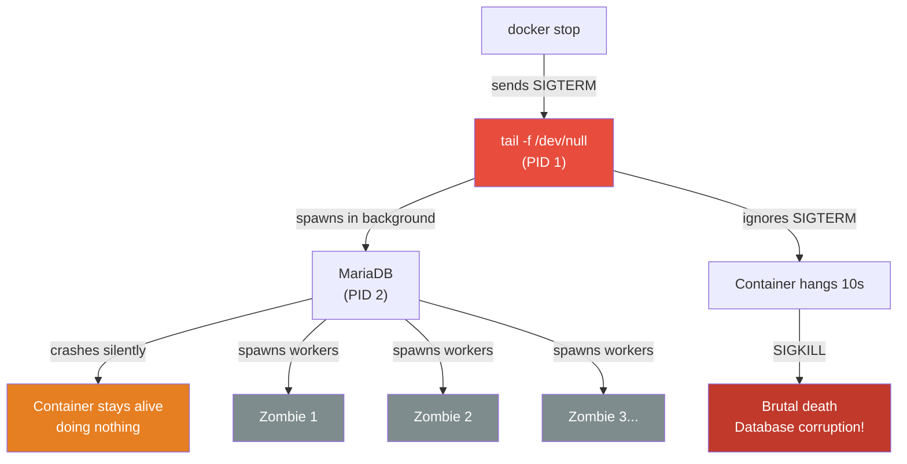

1.  **It breaks `docker stop` (The Signal Problem):** Docker sends `SIGTERM` to PID 1 (`tail -f`). As PID 1, it gets special kernel protection and ignores the signal. The container hangs for 10 seconds, then gets `SIGKILL`. If MariaDB was mid-write, the database is **corrupted**.
2.  **It creates Zombies (The Reaper Problem):** If MariaDB spawns sub-processes that die, PID 1 must reap them. `tail -f` doesn't know how to reap zombies. Over time, the container fills with dead processes until it crashes.
3.  **It masks application crashes:** If MariaDB crashes in the background, the container *should* die so Docker can restart it (via `restart: always`). But `tail -f` keeps PID 1 alive, so Docker thinks everything is fine while the database is completely dead.

#### The Correct Solution: Foreground Processes
Run your actual application in the **foreground** as PID 1. Tell the application *not* to daemonize:

| Service | Foreground Flag | What It Does |
|---------|----------------|--------------|
| **NGINX** | `daemon off;` | Prevents NGINX from forking into the background |
| **PHP-FPM** | `-F` or `--nodaemonize` | Keeps PHP-FPM in the foreground |
| **MariaDB** | `mysqld_safe` or `mysqld` | Runs the database server directly (not via `service`) |

By doing this:
1.  Your application *is* PID 1 and handles `SIGTERM` gracefully.
2.  If your application crashes, PID 1 dies, the container stops, and Docker Compose immediately restarts it.
3.  Professional applications (NGINX, MariaDB, PHP-FPM) are designed to catch signals and shut down databases safely.

---

## Module 3: The Orchestration Layer

*Managing a single container is easy. Managing multiple containers that need to talk to each other and share data requires orchestration tools like Docker Compose.*

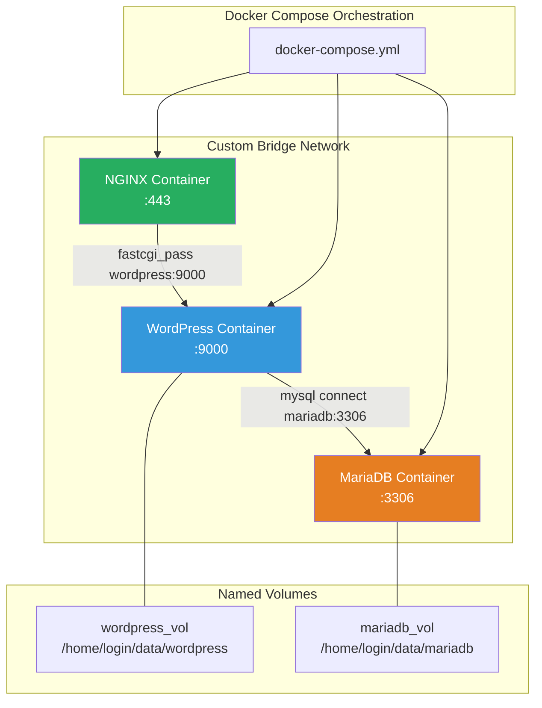

### 1. Docker Compose

#### What is Docker Compose?
Docker Compose is a separate command-line tool (invoked via `docker compose` or `docker-compose`) that reads a YAML file and translates it into a series of API requests for the Docker Daemon. Its purpose is to manage **Infrastructure as Code (IaC)**.

*   **YAML** is a plain-text format that uses indentation (spaces, never tabs) to organize data. Docker Compose uses it because it is easy for humans to read.
*   **Infrastructure as Code (IaC)** means defining your entire infrastructure in a text file that can be version-controlled, shared, and rebuilt instantly, instead of manually typing commands.

#### How Docker Compose Works
Docker Compose does not have any special power. The Docker Daemon is still the only software that talks to the Linux Kernel. Compose is just a translator between your YAML file and the Daemon.

When you type `docker compose up`, the following happens in order:

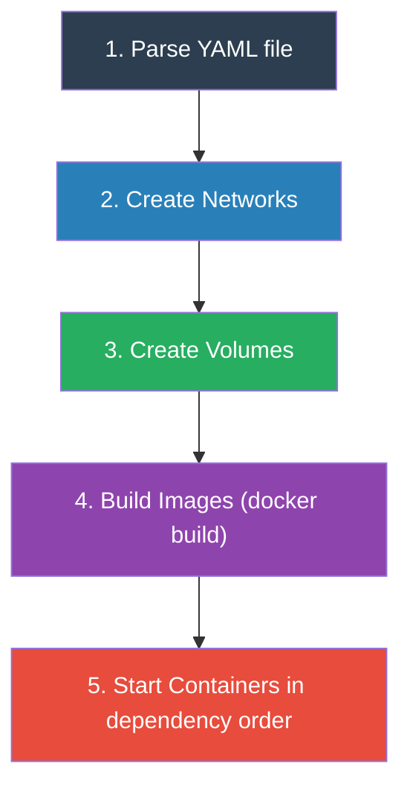

1.  **Parsing:** Compose reads your `docker-compose.yml` and checks for syntax errors.
2.  **Networks:** It sends API requests to the Daemon to create the networks defined in the `networks:` section.
3.  **Volumes:** It sends requests to create the volumes defined in the `volumes:` section.
4.  **Building Images:** For each service with a `build:` instruction, it zips the build context and sends it to the Daemon to build the image.
5.  **Starting Containers:** It reads the `depends_on` rules to determine the correct start order, then tells the Daemon to run each container with the specified networks, volumes, and environment variables attached.

#### The Project Name
When you run `docker compose up`, Compose uses the name of your current folder (e.g., `srcs`) as the "Project Name." It prepends this to all created resources:
*   Network becomes `srcs_inception_net`
*   Container becomes `srcs-nginx-1`

When you type `docker compose down`, Compose tells the Daemon to delete everything with that project prefix.

#### The `docker-compose.yml` Structure
The file has three main blocks:
1.  **`services:`** — Defines your containers (`mariadb`, `wordpress`, `nginx`), their build contexts, ports, and environment variables.
2.  **`volumes:`** — Defines the persistent storage areas.
3.  **`networks:`** — Defines the custom bridge network.

#### The Classic Inception Trap: `depends_on`
In your `docker-compose.yml`, you can tell Compose that WordPress depends on MariaDB:
```yaml
services:
  wordpress:
    depends_on:
      - mariadb
```

**The Trap:** `depends_on` only guarantees the **Start Order** — it starts the MariaDB container first. But it does **not** wait for MariaDB to finish initializing its database and be ready to accept connections. MariaDB might take 5–10 seconds to initialize, and WordPress will crash if it tries to connect during that time.

**The Solution:** Write a wait loop in your WordPress entrypoint script:
```bash
while ! mysqladmin ping -h"mariadb" --silent; do
    echo "Waiting for MariaDB to be ready..."
    sleep 2
done
echo "MariaDB is ready! Starting WordPress setup..."
```

---

### 2. Docker Networks

#### What is a Docker Network?
By default, when a container starts, it is completely isolated by the Linux kernel's NET Namespace. It cannot send or receive network traffic.

A **Docker Network** is a software-based network created by Docker inside your host's Linux kernel. When you connect a container to a Docker Network, Docker does two things:
1.  It creates a virtual network interface (like `eth0`) inside the container.
2.  It assigns that interface a private IP address (for example, `172.18.0.2`).

Because the containers now have IP addresses on the same subnet, the Linux kernel can route data packets (like HTTP requests or SQL queries) between them.

#### What is a Bridge Network?
**Bridge** is the default and most common network driver type. A Bridge Network creates an isolated, private network segment on your host machine.
*   If you put `nginx`, `wordpress`, and `mariadb` on the same Bridge Network, they can send traffic to each other using their private IP addresses.
*   They are isolated from the outside. A computer on your local Wi-Fi cannot directly access the `mariadb` container's private IP address.
*   Containers on different Bridge Networks cannot communicate with each other.

In Docker Compose, when you define a network, Docker automatically creates a custom Bridge Network and attaches all your services to it.

#### What is DNS Resolution?
**DNS (Domain Name System)** translates a human-readable name (like `google.com`) into a machine IP address (like `142.250.190.46`).

In Docker, IP addresses are assigned dynamically. If you restart the `mariadb` container, its IP address might change from `172.18.0.2` to `172.18.0.5`. You cannot hardcode IP addresses into your configuration files.

**How Docker solves this:** When you create a custom Bridge Network, Docker runs a hidden DNS server inside that network. It automatically registers the **service name** (from your `docker-compose.yml`) to the container's current IP address.

When WordPress needs to connect to the database:
1.  WordPress asks Docker DNS: *"What is the IP address for `mariadb`?"*
2.  Docker DNS answers: *"`mariadb` is at `172.18.0.5`."*
3.  WordPress connects successfully.

In your configuration, you simply write `mariadb` as the database host. Docker handles all the IP translation automatically.

#### Why `--link` and `host` Network are Forbidden
*   **`--link`:** A legacy feature from 2014, before Docker invented custom bridge networks and internal DNS. It is obsolete and deprecated.
*   **`network: host`:** Tells Docker to skip the NET Namespace entirely, letting the container use the host machine's actual network card directly. This completely destroys network isolation and defeats the purpose of containerization.

---

### 3. Docker Volumes

#### The Ephemeral Storage Problem
Containers are ephemeral. When a container runs, any new files it creates are saved in the thin Writable Layer (via OverlayFS). If you delete the container (`docker rm`), the Writable Layer is instantly destroyed. Every database, table, and row vanishes forever.

#### What is a Docker Volume?
A Docker Volume bypasses the container's isolated filesystem (the MNT Namespace). When you create a Volume, you tell Docker to link a specific folder *inside* the container directly to a folder on your Host Machine's physical hard drive.

When MariaDB saves data to `/var/lib/mysql` inside the container, that data is actually written directly to the host's hard drive, outside the container's OverlayFS layers.

#### How Volumes Guarantee Persistence
Because the data lives on the Host Machine's hard drive:
*   If the MariaDB container crashes, the data remains on the host.
*   If you completely delete the container and build a new one, you attach the new container to the existing Volume. The new container instantly sees all the old database files.

#### Bind Mounts vs. Named Volumes

| Type | How it Works | Inception Rule |
|------|-------------|----------------|
| **Bind Mounts** | You manually specify a host path (e.g., `/home/aysadeq/my_folder:/app`) | ❌ **Forbidden** for main volumes |
| **Named Volumes** | You give the volume a name (e.g., `mariadb_vol`) and Docker manages it | ✅ **Required** |

#### The Inception Volume Requirement (The Tricky Part)
The 42 subject has a specific requirement:
1.  You **must** use Named Volumes.
2.  The data **must** be stored at `/home/login/data/wordpress` and `/home/login/data/mariadb` on the host.

Normally, Named Volumes are stored deep inside Docker's internal folders (`/var/lib/docker/volumes`). To satisfy the subject, you use **Driver Options** to force Docker to store the Named Volume at a specific path:

```yaml
volumes:
  wordpress_vol:
    driver: local
    driver_opts:
      type: none
      o: bind
      device: /home/aysadeq/data/wordpress
  mariadb_vol:
    driver: local
    driver_opts:
      type: none
      o: bind
      device: /home/aysadeq/data/mariadb
```

---

### 4. Environment Variables & Secrets

#### The Principle of Parameterization
Docker Images should be 100% generic and reusable. You must **never** hardcode passwords into your `Dockerfile` or scripts. Instead, you write your scripts to read **Environment Variables** — dynamic text values injected by the operating system at runtime.

Your container reads `$MYSQL_ROOT_PASSWORD` and uses whatever value it finds to configure the database. This allows one generic image to be used with different credentials.

#### The `.env` File
A plain text file where you store all your configurations in `KEY=VALUE` format:
```text
MYSQL_ROOT_PASSWORD=super_secret_root
MYSQL_DATABASE=wordpress_db
WP_TITLE=Inception_Blog
```

When you run `docker compose up`, Docker Compose automatically reads the `.env` file and injects all those variables into your running containers.

**Security Rule:** The `.env` file contains real passwords. You must **never** commit it to Git. Add `.env` to your `.gitignore` file. Passwords found in the Git repository = **automatic project failure**.

#### Docker Secrets (The Recommended Upgrade)
The Inception subject states: *"We strongly recommend the use of secrets for passwords."*

**The flaw of `.env` variables:** Anyone with access to the host can type `docker inspect <container>` and see all environment variables — including passwords — in plain text.

**Docker Secrets** fix this:
1.  You write the password into a small text file (e.g., `secrets/db_password.txt`).
2.  In your `docker-compose.yml`, you define a secret.
3.  Docker Compose mounts that file into the container's memory at `/run/secrets/db_password`.
4.  Your application reads the file to get the password.

Because the password is in a mounted file (not an environment variable), it **never** appears in `docker inspect` output. It is much more secure.

---

### 5. Container Restart Policies

The Inception subject states: *"Your containers have to restart in case of a crash."*

Containers can crash due to memory limits (Cgroup OOM Killer), fatal application errors, or unexpected bugs. Restart policies tell the Docker Daemon to act as an automated babysitter, restarting containers without manual intervention.

You add one line to each service in your `docker-compose.yml`:
```yaml
services:
  nginx:
    restart: always
```

#### The Three Main Policies

| Policy | Restarts on Crash? | Restarts on Clean Exit? | Survives Host Reboot? | Respects Manual Stop? |
|--------|:-:|:-:|:-:|:-:|
| `restart: always` | ✅ | ✅ | ✅ | ❌ (restarts anyway) |
| `restart: on-failure` | ✅ | ❌ | ❌ | ✅ |
| `restart: unless-stopped` | ✅ | ✅ | ✅ | ✅ (stays stopped) |

*   **`always`:** The most aggressive. Always restarts, no matter what. Even after host reboot.
*   **`on-failure`:** Only restarts if PID 1 exits with a non-zero (error) exit code. If it exits cleanly (code 0), Docker leaves it alone.
*   **`unless-stopped`:** Behaves like `always`, but if you manually `docker stop` a container, the Daemon remembers and will not restart it after a reboot.

---

## Module 4: The Application Stack (LEMP)

*How the specific technologies requested by the Inception subject interact to serve a website.*

### The Full Request Flow

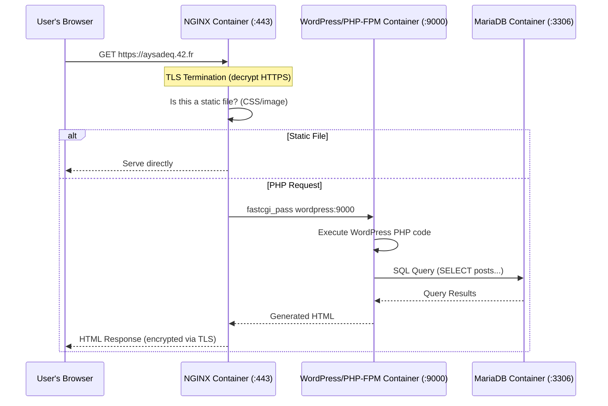

### 1. The LEMP Architecture Overview

The LEMP stack is an industry-standard web architecture:
*   **L**inux (The OS running inside our containers)
*   **E**Nginx (The web server — the "E" comes from its pronunciation: "Engine-X")
*   **M**ariaDB (The database)
*   **P**HP-FPM (The language processor that runs WordPress)

#### The Golden Rule of NGINX
NGINX is fast and powerful, but it has one massive limitation: **NGINX cannot read or execute PHP code.** If you ask NGINX for a static file (like `logo.jpg`), it serves it directly. But WordPress is written entirely in PHP. If NGINX tries to serve a `.php` file, it just sends the raw, unexecuted code text to the browser, which is useless.

Because NGINX can't process PHP, it acts as a **Reverse Proxy**. When it receives a request for a `.php` file, it packages the request up and sends it over the Docker Network to the PHP-FPM container using a protocol called **FastCGI**.

#### The Full Lifecycle of a Web Request
When the evaluator types `https://aysadeq.42.fr` into their browser:

1.  **The Request Arrives:** The browser sends a secure (HTTPS) request to port 443. Docker forwards this to the **NGINX container**.
2.  **Decryption:** NGINX uses the TLS certificate to decrypt the HTTPS traffic.
3.  **The Handoff:** NGINX sees the user is asking for `index.php`. It forwards the request to the **WordPress (PHP-FPM) container** on port 9000.
4.  **Execution:** PHP-FPM receives the request and starts executing the WordPress PHP code.
5.  **The Database Query:** WordPress needs the latest blog post. It opens a TCP connection to the **MariaDB container** on port 3306 and sends an SQL query.
6.  **The Return Journey:**
    *   MariaDB finds the post in the Volume and returns the text to PHP.
    *   PHP injects the text into an HTML template and hands the finished HTML back to NGINX.
    *   NGINX encrypts the HTML and sends it back to the browser.

---

### 2. NGINX (The Web Server)

NGINX is the public face of the infrastructure. For the Inception project, you will write a custom configuration file that tells NGINX exactly how to handle incoming traffic.

#### The `server` Block
The NGINX configuration is organized into blocks. The `server` block defines a website. Inside it, you must tell NGINX three critical things:

```nginx
server {
    listen 443 ssl;                    # Open port 443, expect encrypted traffic
    server_name aysadeq.42.fr;         # Only respond to this domain name
    root /var/www/html;                # Where to find the website files (the Volume!)
}
```

#### The `location` Blocks (Routing Traffic)
Once NGINX receives a request, it uses `location` blocks to decide what to do based on the URL path.

**Serving Static Files:**
```nginx
location / {
    try_files $uri $uri/ =404;
}
```
If the user asks for `logo.png`, NGINX checks the hard drive (the volume). If the file exists, it serves it directly. If not, it returns a 404 error.

**The Reverse Proxy (PHP Requests):**
```nginx
location ~ \.php$ {
    include fastcgi_params;
    fastcgi_pass wordpress:9000;
}
```
This block uses a Regular Expression (`~ \.php$`). It says: *"If the requested file ends in `.php`, DO NOT serve it from the hard drive. Instead, send it over the Docker Network to the container named `wordpress` on port `9000`."*

#### The PID 1 Rule
By default, NGINX daemonizes (forks into the background). Inside a container, this would cause PID 1 to exit and the container to die. You must force it to stay in the foreground:
```dockerfile
CMD ["nginx", "-g", "daemon off;"]
```

---

### 3. TLS/SSL (HTTPS)

The Inception subject requires your website to **only** be accessible via HTTPS on port 443. If an evaluator can access your site via HTTP on port 80, you fail.

#### The Problem: HTTP is Plain Text
If you log into WordPress using standard HTTP, your username and password are sent over the network in plain text. Anyone on the same network can read them. **HTTPS** encrypts this traffic so it looks like random garbage to eavesdroppers.

#### The Key and the Certificate
To enable HTTPS, NGINX needs two files:

| File | Purpose |
|------|---------|
| **Private Key (`.key`)** | The mathematical secret used to decrypt traffic. Must be kept hidden inside the container. |
| **Certificate (`.crt`)** | The public "Identity Card." NGINX shows this to the browser: *"I am `aysadeq.42.fr`, and here is my public key so you can encrypt messages to me."* |

#### Self-Signed vs. CA-Signed
In the real world, you pay a **Certificate Authority (CA)** to verify your identity and sign your certificate. Browsers have a built-in list of trusted CAs.

For Inception, you use a **Self-Signed Certificate** generated with `openssl`. The browser will show a warning (*"Potential Security Risk!"*) because it doesn't trust your homemade certificate. This is completely normal and expected. The evaluator clicks "Accept the Risk." The encryption is still 100% functional.

#### How to Generate It
```bash
openssl req -x509 -nodes -days 365 -newkey rsa:2048 \
    -keyout /etc/ssl/private/nginx-selfsigned.key \
    -out /etc/ssl/certs/nginx-selfsigned.crt \
    -subj "/C=MA/L=Khouribga/O=1337/OU=Student/CN=aysadeq.42.fr"
```

#### The TLS Version Rule
The subject states: *"Your TLS certificate has to be TLSv1.2 or TLSv1.3."*

Old protocols (SSLv3, TLSv1.0, TLSv1.1) have known security vulnerabilities. You must explicitly disable them in your `nginx.conf`:
```nginx
ssl_protocols TLSv1.2 TLSv1.3;
```

---

### 4. MariaDB (The Database)

#### What is a Database?
A database is a highly-organized, high-speed digital filing cabinet. Instead of dumping all your data into a massive text file (which would be impossibly slow to search), a database stores data in structured **Tables** (like Excel spreadsheets).

#### What is a Relational Database?
MariaDB is a **Relational Database**. "Relational" means it can link tables together:
*   You have a Table for Users (username, email, password hash).
*   You have a Table for Blog Posts (title, content, date).
*   The database links them: *"The user in row 4 wrote the blog post in row 92."*

When WordPress wants to load a page, it sends a command (using a language called **SQL**) to the database: *"Fetch me the blog post from row 92."* The database finds it in microseconds.

#### What is MariaDB?
MariaDB is a free, open-source clone of **MySQL** (the most famous database in the world). The original creators of MySQL forked it after Oracle bought MySQL, to keep it free. For this project, MariaDB and MySQL are functionally identical. They use the same commands, the same port (`3306`), and the same structure.

#### MariaDB's Role in Inception
MariaDB is the ultimate source of truth. Every blog post, comment, and user is saved in MariaDB. This data is persisted to the host via the Docker Volume.

**Important:** NGINX never talks to MariaDB directly. The flow is always: NGINX → PHP-FPM → MariaDB.

#### Setup and Security Requirements
Your MariaDB entrypoint script must:
1.  **Set the Root Password:** Configure a strong password for the `root` user.
2.  **Lock Down Root:** Ensure the root user cannot log in from the network (only from localhost inside the container).
3.  **Create the WordPress Database:** Create an empty database (e.g., `wordpress_db`).
4.  **Create a Dedicated User:** Never let WordPress connect as `root`. Create a limited user (e.g., `wp_user`) with access *only* to `wordpress_db`. If WordPress gets hacked, the attacker can only access the WordPress database, not your entire database system.

All names and passwords are injected via **Environment Variables and Secrets** from Module 3.

---

### 5. PHP-FPM (FastCGI Process Manager)

#### What is PHP?
HTML is static — `<h1>Hello</h1>` says "Hello" forever. WordPress needs to be dynamic — the homepage changes every time you publish a new post. **PHP** is the programming language WordPress is written in. When a PHP file runs, it connects to the database, fetches data, and builds a brand new HTML page from scratch.

#### What is PHP-FPM?
**FPM** stands for **FastCGI Process Manager**. PHP-FPM is a standalone daemon whose only job is to wait for NGINX to send it PHP files, execute them, and return the resulting HTML.

**How it works:**
1.  PHP-FPM starts up and listens on port `9000`.
2.  NGINX receives a request for `index.php` and sends it over the Docker Network to port 9000.
3.  PHP-FPM spawns a temporary "worker process" to handle the job.
4.  The worker reads the WordPress PHP code, talks to MariaDB, generates HTML, hands it back to NGINX, and then dies.

#### The Configuration Challenge (Socket vs. Port)
By default, PHP-FPM listens on a local UNIX Socket (a file at `/run/php/php-fpm.sock`). This works if NGINX and PHP are on the same machine.

But in Docker, NGINX and PHP are in **separate, isolated containers**. NGINX cannot read files inside the PHP container. You must change the PHP-FPM configuration (`www.conf`) to listen on a network port instead:
```ini
; Change this (file-based, only works locally):
listen = /run/php/php8.2-fpm.sock

; To this (network-based, works across containers):
listen = 9000
```

#### The PID 1 Rule
PHP-FPM daemonizes by default. You must force it to run in the foreground with the `-F` flag:
```dockerfile
CMD ["php-fpm8.2", "-F"]
```

---

### 6. WordPress

WordPress is the most popular Content Management System (CMS) in the world. It is a massive collection of PHP files that provides a complete website and administration dashboard. WordPress lives inside the PHP-FPM container, and its files are saved to the persistent Docker Volume.

#### The Configuration File (`wp-config.php`)
When you download WordPress, it doesn't know anything about your infrastructure. You must tell it where the database is via a file called `wp-config.php`. Inside this file, WordPress expects:
*   The Database Name
*   The Database Username
*   The Database Password
*   The Database Hostname (simply `mariadb`, thanks to Docker DNS)

You will dynamically generate this file in your entrypoint script using Environment Variables.

#### The Automation Problem (WP-CLI)
Normally, WordPress is installed via a graphical web installer. The evaluator opens the browser and sees a "5-Minute Installer" screen.

**The 42 subject forbids this.** When the evaluator types `https://aysadeq.42.fr`, they must immediately see a fully installed, working WordPress site — not the installation screen.

**The Solution: WP-CLI** (WordPress Command Line Interface) is a program you install inside your PHP container. It lets you install and configure WordPress entirely through terminal commands in a bash script:

1.  Download the WordPress core files.
2.  Generate `wp-config.php` using environment variables.
3.  Run the core installation (setting site title, creating admin user).
4.  Create the second regular user.

#### The Strict User Requirements

| Rule | Requirement |
|------|-------------|
| **Minimum Users** | At least two users must be created during automated setup |
| **Administrator** | One user must have the "Administrator" role |
| **The "Admin" Trap** | The admin username **CANNOT** contain "admin" or "Admin" in any form (`admin`, `Administrator`, `super_admin` = **FAIL**). Use something like `aysadeq_boss` |
| **Regular User** | The second user should have a lesser role like "Author" or "Subscriber" |

---

### 7. Domain Name Configuration

The Inception subject requires your project to be accessible via `https://aysadeq.42.fr`. You do not own this domain, and no public DNS server knows about it.

#### The Solution: The `/etc/hosts` File
Every Linux, Mac, and Windows computer has a `hosts` file. On Linux, it is located at `/etc/hosts`.

This file is a **local DNS override**. When you type a URL into your browser, before the OS ever asks the internet for the IP address, **it always checks `/etc/hosts` first.**

#### How to Configure It
Edit the file on your host machine (your VM) and add a single line:
```text
127.0.0.1	localhost
127.0.1.1	aysadeq-laptop

# Added for Inception
127.0.0.1	aysadeq.42.fr
```

#### The Final Flow
1.  The evaluator types `https://aysadeq.42.fr` into the browser.
2.  The OS checks `/etc/hosts`, finds the match, and resolves it to `127.0.0.1` (your own computer).
3.  The browser sends the HTTPS request to port 443 on your own computer.
4.  Docker Compose (listening on port 443) forwards the request into the NGINX container.
5.  NGINX decrypts it, sends it to PHP-FPM, PHP-FPM talks to MariaDB, and the WordPress site is served back!

---

## Module 5: Visual Summary — How Everything Connects

*This module ties together every concept from Modules 1–4 into a single, visual picture of the entire Inception infrastructure.*

### 1. The Full Infrastructure Map

This is the bird's-eye view of your entire Inception project. Everything you learned lives inside this diagram.

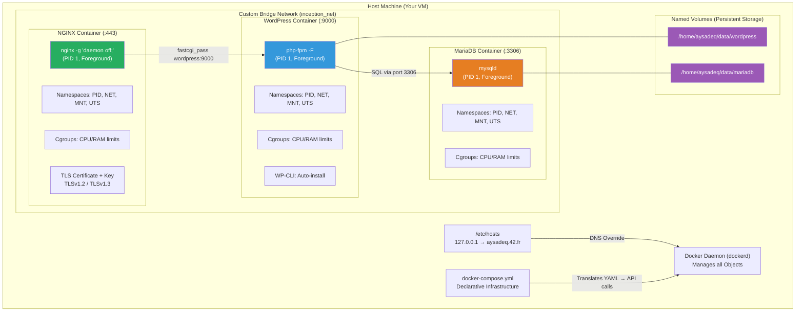

---

### 2. What Makes a Container? (The Anatomy)

Every single container in your project is built from the same Linux kernel features you learned in Module 1.

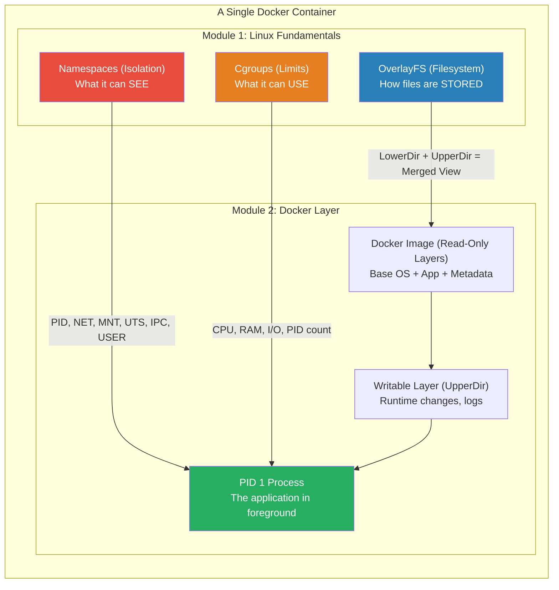

---

### 3. The Complete Request Journey

From the evaluator's keyboard to the database and back, with every Module's concept labeled.

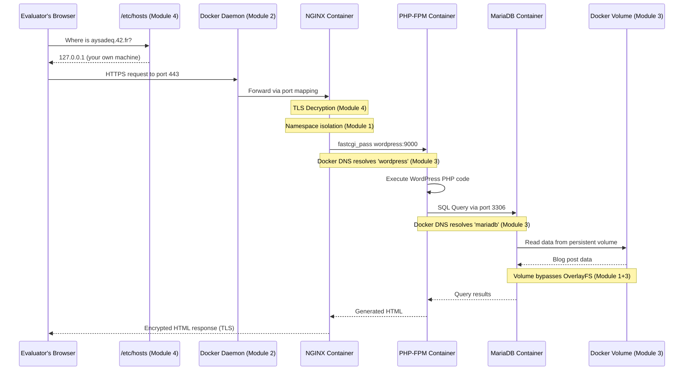

---

### 4. The Build Pipeline

What happens behind the scenes when you type `make` (which runs `docker compose up --build`).

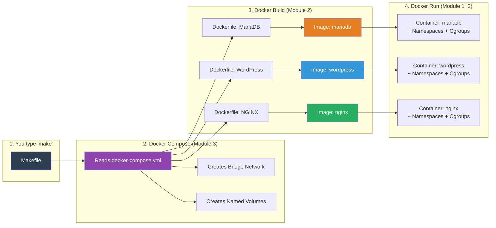

---

### 5. The Persistence & Restart Lifecycle

What happens when things go wrong, and how your data survives.

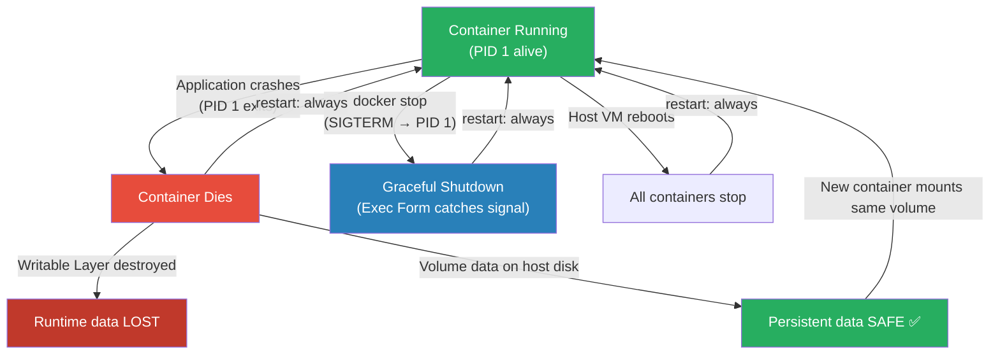

---

### 6. Concept-to-Module Quick Reference

| Concept | Module | Why It Matters for Inception |
|---------|--------|------------------------------|
| Processes & PID 1 | 1 | Your app must be PID 1 in foreground. No `tail -f`! |
| Signals (SIGTERM) | 1 | `docker stop` sends SIGTERM. Exec Form ensures graceful shutdown. |
| Namespaces | 1 | Each container gets isolated PID, NET, MNT, UTS, IPC, USER. |
| Cgroups | 1 | Prevents one container from crashing the entire host. |
| OverlayFS | 1 | Images share read-only layers. Containers add a writable layer on top. |
| Docker Daemon | 2 | The only software that talks to the Linux kernel. |
| Docker Image | 2 | A frozen `.tar` archive of user-space files. Not a full OS! |
| Docker Container | 2 | Image + Writable Layer + Namespaces + Cgroups = Running process. |
| Dockerfile | 2 | The recipe. `FROM`, `RUN`, `COPY`, `CMD`. Always Exec Form. No `latest`. |
| Build Context | 2 | Everything in `.` is sent to Daemon. Use `.dockerignore`! |
| Docker Compose | 3 | Translates YAML into API calls. Manages the full stack. |
| Bridge Network | 3 | Private virtual network. Containers talk via service names (DNS). |
| Named Volumes | 3 | Data persists on host disk. Survives container deletion. |
| `.env` & Secrets | 3 | Never hardcode passwords. Never commit them to Git. |
| Restart Policies | 3 | `restart: always` recovers from crashes and reboots. |
| NGINX | 4 | Listens on 443, serves static files, proxies PHP to port 9000. |
| TLS/SSL | 4 | Self-signed cert via `openssl`. Only TLSv1.2/1.3. |
| MariaDB | 4 | Relational DB on port 3306. Root locked down. Dedicated WP user. |
| PHP-FPM | 4 | Executes WordPress PHP. Listens on port 9000 (not a socket!). |
| WordPress | 4 | Automated install via WP-CLI. Admin name ≠ "admin". Two users. |
| `/etc/hosts` | 4 | Maps `aysadeq.42.fr` → `127.0.0.1` for local DNS override. |
